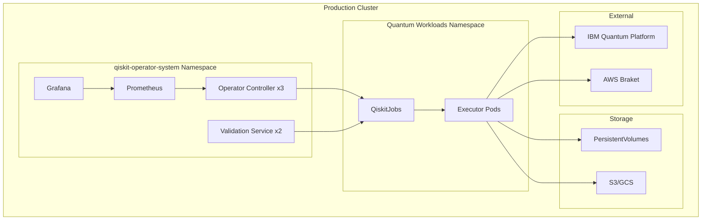

# Production Deployment Guide

This guide covers best practices for deploying QiskitOperator to production environments.

## Pre-Deployment Checklist

Before deploying to production, ensure you have:

- [ ] Kubernetes cluster v1.24+ with appropriate node resources
- [ ] Helm v3+ installed (if using Helm deployment)
- [ ] Persistent storage configured (StorageClass available)
- [ ] Ingress controller configured (if exposing services)
- [ ] Monitoring stack deployed (Prometheus + Grafana)
- [ ] Secrets management solution (Vault, Sealed Secrets, or External Secrets)
- [ ] IBM Quantum API credentials (for real quantum hardware)
- [ ] Backup and disaster recovery plan
- [ ] Resource quotas and limits defined

## Production Architecture



## Installation Methods

### Option 1: Helm (Recommended)

Create a production values file `production-values.yaml`:

```yaml
# Operator configuration
operator:
  replicas: 3
  resources:
    requests:
      cpu: "1"
      memory: "2Gi"
    limits:
      cpu: "4"
      memory: "8Gi"
  
  affinity:
    podAntiAffinity:
      preferredDuringSchedulingIgnoredDuringExecution:
        - weight: 100
          podAffinityTerm:
            labelSelector:
              matchLabels:
                app: qiskit-operator-controller
            topologyKey: kubernetes.io/hostname
  
  tolerations:
    - key: "workload-type"
      operator: "Equal"
      value: "quantum"
      effect: "NoSchedule"

# Validation service configuration
validationService:
  replicas: 2
  resources:
    requests:
      cpu: "500m"
      memory: "1Gi"
    limits:
      cpu: "2"
      memory: "4Gi"
  
  autoscaling:
    enabled: true
    minReplicas: 2
    maxReplicas: 10
    targetCPUUtilizationPercentage: 70

# Metrics and monitoring
metrics:
  enabled: true
  serviceMonitor:
    enabled: true
    interval: 30s

# Security
security:
  podSecurityStandards:
    enforce: "restricted"
  
  networkPolicies:
    enabled: true
  
  rbac:
    create: true

# Storage
storage:
  storageClass: "fast-ssd"  # Use fast storage for quantum simulations
  
  persistence:
    enabled: true
    size: "100Gi"

# Executor pods configuration
executorPods:
  image:
    registry: your-registry.com
    repository: qiskit-executor
    tag: "v1.0.0"
    pullPolicy: IfNotPresent
  
  imagePullSecrets:
    - name: registry-credentials
  
  defaultResources:
    requests:
      cpu: "1"
      memory: "4Gi"
    limits:
      cpu: "8"
      memory: "32Gi"
  
  securityContext:
    runAsNonRoot: true
    runAsUser: 1000
    fsGroup: 2000
    seccompProfile:
      type: RuntimeDefault

# High availability
highAvailability:
  leaderElection:
    enabled: true
    leaseDuration: 15s
    renewDeadline: 10s
    retryPeriod: 2s
```

Install with Helm:

```bash
# Add Helm repository
helm repo add qiskit-operator https://quantum-operator.github.io/qiskit-operator
helm repo update

# Create namespace
kubectl create namespace qiskit-operator-system

# Install with production values
helm install qiskit-operator qiskit-operator/qiskit-operator \
  --namespace qiskit-operator-system \
  --values production-values.yaml \
  --wait

# Verify installation
helm status qiskit-operator -n qiskit-operator-system
kubectl get pods -n qiskit-operator-system
```

### Option 2: Kustomize

Create a production overlay:

```bash
# Directory structure
production/
├── kustomization.yaml
├── namespace.yaml
├── resources-patch.yaml
├── replicas-patch.yaml
└── secrets/
    └── credentials.yaml
```

**`production/kustomization.yaml`:**

```yaml
apiVersion: kustomize.config.k8s.io/v1beta1
kind: Kustomization

namespace: qiskit-operator-system

resources:
  - https://github.com/quantum-operator/qiskit-operator/config/default
  - namespace.yaml
  - secrets/

patchesStrategicMerge:
  - resources-patch.yaml
  - replicas-patch.yaml

images:
  - name: qiskit-operator
    newName: your-registry.com/qiskit-operator
    newTag: v1.0.0
  - name: qiskit-executor
    newName: your-registry.com/qiskit-executor
    newTag: v1.0.0

configMapGenerator:
  - name: operator-config
    literals:
      - LOG_LEVEL=info
      - METRICS_PORT=8080
      - HEALTH_PROBE_PORT=8081

labels:
  - includeSelectors: true
    pairs:
      environment: production
      managed-by: kustomize
```

**`production/replicas-patch.yaml`:**

```yaml
apiVersion: apps/v1
kind: Deployment
metadata:
  name: qiskit-operator-controller
  namespace: qiskit-operator-system
spec:
  replicas: 3
---
apiVersion: apps/v1
kind: Deployment
metadata:
  name: validation-service
  namespace: qiskit-operator-system
spec:
  replicas: 2
```

Apply with kubectl:

```bash
kubectl apply -k production/
```

## Security Hardening

### 1. Pod Security Standards

Apply restricted pod security standard:

```yaml
apiVersion: v1
kind: Namespace
metadata:
  name: qiskit-operator-system
  labels:
    pod-security.kubernetes.io/enforce: restricted
    pod-security.kubernetes.io/audit: restricted
    pod-security.kubernetes.io/warn: restricted
```

### 2. Network Policies

Restrict network access:

```yaml
apiVersion: networking.k8s.io/v1
kind: NetworkPolicy
metadata:
  name: qiskit-operator-network-policy
  namespace: qiskit-operator-system
spec:
  podSelector:
    matchLabels:
      app: qiskit-operator
  policyTypes:
    - Ingress
    - Egress
  
  ingress:
    # Allow metrics scraping from Prometheus
    - from:
        - namespaceSelector:
            matchLabels:
              name: monitoring
      ports:
        - protocol: TCP
          port: 8080
  
  egress:
    # Allow DNS
    - to:
        - namespaceSelector: {}
      ports:
        - protocol: UDP
          port: 53
    
    # Allow Kubernetes API
    - to:
        - namespaceSelector: {}
      ports:
        - protocol: TCP
          port: 443
    
    # Allow IBM Quantum Platform
    - to:
        - podSelector: {}
      ports:
        - protocol: TCP
          port: 443
```

### 3. RBAC Configuration

Principle of least privilege:

```yaml
apiVersion: rbac.authorization.k8s.io/v1
kind: ClusterRole
metadata:
  name: qiskit-operator-role
rules:
  # QiskitJob CRD
  - apiGroups: ["quantum.io"]
    resources: ["qiskitjobs"]
    verbs: ["get", "list", "watch", "update", "patch"]
  
  - apiGroups: ["quantum.io"]
    resources: ["qiskitjobs/status"]
    verbs: ["get", "update", "patch"]
  
  # Pods (executor pods)
  - apiGroups: [""]
    resources: ["pods"]
    verbs: ["create", "get", "list", "watch", "delete"]
  
  # ConfigMaps (results storage)
  - apiGroups: [""]
    resources: ["configmaps"]
    verbs: ["create", "get", "list", "update", "patch"]
  
  # Secrets (credentials)
  - apiGroups: [""]
    resources: ["secrets"]
    verbs: ["get", "list", "watch"]
  
  # Events
  - apiGroups: [""]
    resources: ["events"]
    verbs: ["create", "patch"]
```

### 4. Secrets Management

#### Option A: Kubernetes Secrets (encrypted at rest)

```bash
# Enable encryption at rest in Kubernetes
# Add to kube-apiserver configuration:
# --encryption-provider-config=/etc/kubernetes/encryption-config.yaml

# Create encrypted secret
kubectl create secret generic ibm-quantum-credentials \
  --from-literal=api-key=YOUR_API_KEY \
  --namespace qiskit-operator-system \
  --dry-run=client -o yaml | kubectl apply -f -
```

#### Option B: HashiCorp Vault

```yaml
apiVersion: secrets-store.csi.x-k8s.io/v1
kind: SecretProviderClass
metadata:
  name: vault-quantum-credentials
spec:
  provider: vault
  parameters:
    vaultAddress: "https://vault.example.com"
    roleName: "qiskit-operator"
    objects: |
      - objectName: "ibm-quantum-api-key"
        secretPath: "secret/data/quantum/ibm"
        secretKey: "api-key"
```

#### Option C: External Secrets Operator

```yaml
apiVersion: external-secrets.io/v1beta1
kind: ExternalSecret
metadata:
  name: ibm-quantum-credentials
  namespace: qiskit-operator-system
spec:
  refreshInterval: 1h
  secretStoreRef:
    name: aws-secrets-manager
    kind: SecretStore
  target:
    name: ibm-quantum-credentials
  data:
    - secretKey: api-key
      remoteRef:
        key: quantum/ibm-api-key
```

## High Availability

### Controller High Availability

Deploy multiple controller replicas with leader election:

```yaml
apiVersion: apps/v1
kind: Deployment
metadata:
  name: qiskit-operator-controller
spec:
  replicas: 3
  
  strategy:
    type: RollingUpdate
    rollingUpdate:
      maxSurge: 1
      maxUnavailable: 1
  
  template:
    spec:
      affinity:
        podAntiAffinity:
          preferredDuringSchedulingIgnoredDuringExecution:
            - weight: 100
              podAffinityTerm:
                labelSelector:
                  matchLabels:
                    app: qiskit-operator-controller
                topologyKey: kubernetes.io/hostname
      
      topologySpreadConstraints:
        - maxSkew: 1
          topologyKey: topology.kubernetes.io/zone
          whenUnsatisfiable: DoNotSchedule
          labelSelector:
            matchLabels:
              app: qiskit-operator-controller
```

### Validation Service High Availability

```yaml
apiVersion: apps/v1
kind: Deployment
metadata:
  name: validation-service
spec:
  replicas: 2
  
  template:
    spec:
      affinity:
        podAntiAffinity:
          requiredDuringSchedulingIgnoredDuringExecution:
            - labelSelector:
                matchLabels:
                  app: validation-service
              topologyKey: kubernetes.io/hostname
---
apiVersion: autoscaling/v2
kind: HorizontalPodAutoscaler
metadata:
  name: validation-service-hpa
spec:
  scaleTargetRef:
    apiVersion: apps/v1
    kind: Deployment
    name: validation-service
  minReplicas: 2
  maxReplicas: 10
  metrics:
    - type: Resource
      resource:
        name: cpu
        target:
          type: Utilization
          averageUtilization: 70
    - type: Resource
      resource:
        name: memory
        target:
          type: Utilization
          averageUtilization: 80
```

## Resource Management

### Node Configuration

Reserve nodes for quantum workloads:

```yaml
apiVersion: v1
kind: Node
metadata:
  name: quantum-node-1
  labels:
    workload-type: quantum
    node-size: large
spec:
  taints:
    - key: workload-type
      value: quantum
      effect: NoSchedule
```

### Resource Quotas

Set namespace quotas:

```yaml
apiVersion: v1
kind: ResourceQuota
metadata:
  name: quantum-workloads-quota
  namespace: quantum-workloads
spec:
  hard:
    requests.cpu: "100"
    requests.memory: "500Gi"
    limits.cpu: "200"
    limits.memory: "1Ti"
    persistentvolumeclaims: "50"
    pods: "100"
    services.loadbalancers: "5"
```

### Limit Ranges

Set default limits:

```yaml
apiVersion: v1
kind: LimitRange
metadata:
  name: quantum-limits
  namespace: quantum-workloads
spec:
  limits:
    - max:
        cpu: "32"
        memory: "256Gi"
      min:
        cpu: "100m"
        memory: "128Mi"
      default:
        cpu: "2"
        memory: "8Gi"
      defaultRequest:
        cpu: "1"
        memory: "4Gi"
      type: Container
```

## Monitoring and Observability

### Prometheus ServiceMonitor

```yaml
apiVersion: monitoring.coreos.com/v1
kind: ServiceMonitor
metadata:
  name: qiskit-operator
  namespace: qiskit-operator-system
spec:
  selector:
    matchLabels:
      app: qiskit-operator
  endpoints:
    - port: metrics
      interval: 30s
      path: /metrics
```

### Grafana Dashboards

Install pre-built dashboards:

```bash
kubectl apply -f https://raw.githubusercontent.com/quantum-operator/qiskit-operator/main/config/grafana/dashboards/
```

### Alerting Rules

```yaml
apiVersion: monitoring.coreos.com/v1
kind: PrometheusRule
metadata:
  name: qiskit-operator-alerts
  namespace: qiskit-operator-system
spec:
  groups:
    - name: qiskit-operator
      interval: 30s
      rules:
        - alert: QiskitOperatorDown
          expr: up{job="qiskit-operator"} == 0
          for: 5m
          labels:
            severity: critical
          annotations:
            summary: "QiskitOperator is down"
            description: "QiskitOperator has been down for more than 5 minutes"
        
        - alert: HighJobFailureRate
          expr: rate(qiskitjob_failed_total[5m]) > 0.1
          for: 10m
          labels:
            severity: warning
          annotations:
            summary: "High quantum job failure rate"
            description: "More than 10% of jobs are failing"
        
        - alert: BudgetExceeded
          expr: qiskitbudget_spent_dollars > qiskitbudget_limit_dollars
          for: 1m
          labels:
            severity: critical
          annotations:
            summary: "Quantum computing budget exceeded"
            description: "Namespace {{ $labels.namespace }} has exceeded budget"
```

## Backup and Disaster Recovery

### Backup Custom Resources

```bash
#!/bin/bash
# backup-quantum-resources.sh

BACKUP_DIR="./quantum-backups/$(date +%Y%m%d-%H%M%S)"
mkdir -p "$BACKUP_DIR"

# Backup all QiskitJobs
kubectl get qiskitjobs -A -o yaml > "$BACKUP_DIR/qiskitjobs.yaml"

# Backup all QiskitBackends
kubectl get qiskitbackends -A -o yaml > "$BACKUP_DIR/qiskitbackends.yaml"

# Backup all QiskitBudgets
kubectl get qiskitbudgets -A -o yaml > "$BACKUP_DIR/qiskitbudgets.yaml"

# Backup all QiskitSessions
kubectl get qiskitsessions -A -o yaml > "$BACKUP_DIR/qiskitsessions.yaml"

# Backup secrets (encrypted)
kubectl get secrets -n qiskit-operator-system -o yaml > "$BACKUP_DIR/secrets.yaml"

echo "Backup completed: $BACKUP_DIR"
```

### Velero Integration

```yaml
apiVersion: velero.io/v1
kind: Schedule
metadata:
  name: qiskit-operator-backup
  namespace: velero
spec:
  schedule: "0 2 * * *"  # Daily at 2 AM
  template:
    includedNamespaces:
      - qiskit-operator-system
      - quantum-workloads
    includedResources:
      - qiskitjobs
      - qiskitbackends
      - qiskitbudgets
      - qiskitsessions
      - secrets
      - configmaps
      - persistentvolumeclaims
    storageLocation: default
    volumeSnapshotLocations:
      - default
```

## Upgrading

### Rolling Upgrade

```bash
# Update Helm chart
helm upgrade qiskit-operator qiskit-operator/qiskit-operator \
  --namespace qiskit-operator-system \
  --values production-values.yaml \
  --wait

# Verify upgrade
kubectl rollout status deployment/qiskit-operator-controller -n qiskit-operator-system
kubectl get pods -n qiskit-operator-system
```

### Canary Deployment

```yaml
# Deploy canary version
apiVersion: apps/v1
kind: Deployment
metadata:
  name: qiskit-operator-controller-canary
spec:
  replicas: 1
  template:
    spec:
      containers:
        - name: operator
          image: qiskit-operator:v1.1.0  # New version
---
# Service with traffic splitting
apiVersion: v1
kind: Service
metadata:
  name: qiskit-operator-metrics
spec:
  selector:
    app: qiskit-operator-controller
  # 90% to stable, 10% to canary via Istio/Linkerd
```

## Performance Tuning

### Operator Performance

```yaml
env:
  # Increase reconciliation workers
  - name: CONCURRENT_RECONCILES
    value: "10"
  
  # Adjust queue depth
  - name: MAX_CONCURRENT_JOBS
    value: "100"
  
  # Cache settings
  - name: CACHE_SYNC_TIMEOUT
    value: "5m"
```

### Validation Service Performance

```yaml
resources:
  requests:
    cpu: "2"
    memory: "4Gi"
  limits:
    cpu: "8"
    memory: "16Gi"

env:
  # Gunicorn workers
  - name: WORKERS
    value: "4"
  
  # Threads per worker
  - name: THREADS
    value: "2"
  
  # Request timeout
  - name: TIMEOUT
    value: "120"
```

## Cost Optimization

### Budget Policies

```yaml
apiVersion: quantum.io/v1
kind: QiskitBudget
metadata:
  name: production-budget
  namespace: quantum-workloads
spec:
  limit: "$10000.00"
  period: monthly
  
  alertThresholds:
    - 50
    - 75
    - 90
    - 95
  
  notificationEmail: quantum-team@example.com
  
  enforcement:
    blockOnExceed: true
    gracePeriod: 24h
```

### Backend Selection Strategy

```yaml
spec:
  backendSelection:
    weights:
      cost: 0.60          # Prioritize cost
      queueTime: 0.25
      capability: 0.10
      availability: 0.05
    
    fallbackToSimulator: true  # Use free simulator when possible
    
    requirements:
      maxCost: "$5.00"
```

## Troubleshooting

### Common Production Issues

#### High Memory Usage

**Symptoms:** OOMKilled pods, slow performance

**Solutions:**
```yaml
# Increase memory limits
resources:
  limits:
    memory: "64Gi"

# Enable memory limits for simulations
execution:
  memoryLimit: "32Gi"

# Use disk-based simulation for large circuits
env:
  - name: QISKIT_IN_PARALLEL
    value: "TRUE"
```

#### Queue Buildup

**Symptoms:** Jobs stuck in Pending/Scheduling

**Solutions:**
```bash
# Scale validation service
kubectl scale deployment validation-service -n qiskit-operator-system --replicas=5

# Increase concurrent reconciles
kubectl set env deployment/qiskit-operator-controller \
  -n qiskit-operator-system \
  CONCURRENT_RECONCILES=20
```

### Debug Mode

Enable debug logging:

```yaml
env:
  - name: LOG_LEVEL
    value: "debug"
  
  - name: ENABLE_PROFILING
    value: "true"
```

## Security Audit

Run regular security audits:

```bash
# kubeaudit
kubeaudit all -n qiskit-operator-system

# kube-bench
kube-bench run --targets node,policies

# Trivy (image scanning)
trivy image your-registry.com/qiskit-operator:v1.0.0
```

## Compliance

### SOC 2 Compliance

- Enable audit logging
- Implement RBAC
- Encrypt data at rest and in transit
- Regular vulnerability scanning
- Access controls and MFA

### HIPAA Compliance

- PHI data encryption
- Audit trails
- Access controls
- Business Associate Agreements (BAA) with cloud providers

## Production Checklist

Before going live:

- [ ] High availability configured (3+ replicas)
- [ ] Resource limits set appropriately
- [ ] Monitoring and alerting configured
- [ ] Backups automated
- [ ] Security hardening applied
- [ ] Secrets encrypted and managed securely
- [ ] Network policies in place
- [ ] RBAC configured with least privilege
- [ ] Budget limits set
- [ ] Documentation updated
- [ ] Runbooks created for common scenarios
- [ ] Load testing completed
- [ ] Disaster recovery plan tested

## Support

For production support:

- 📧 Email: support@quantum-operator.io
- 💬 Slack: [Enterprise Support Channel](https://quantum-operator.slack.com)
- 📞 Phone: Available with enterprise license
- 🎫 Tickets: [Support Portal](https://support.quantum-operator.io)

## Next Steps

- [Monitoring Guide](monitoring.md)
- [Security Best Practices](security.md)
- [Troubleshooting Guide](../user-guide/troubleshooting.md)
- [Cost Optimization](cost-optimization.md)

