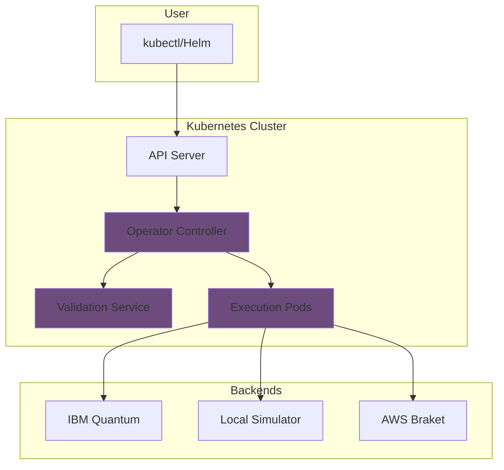

# Getting Started with Qiskit Operator

Welcome to Qiskit Operator! This guide will help you get started with running quantum computing workloads on Kubernetes.

## Overview

Qiskit Operator is a Kubernetes operator that enables you to:

- **Run quantum circuits** on real quantum hardware and simulators
- **Manage quantum workloads** using Kubernetes-native tools
- **Control costs** with budget management and optimization
- **Monitor execution** with Prometheus and Grafana
- **Scale quantum computing** across your organization

## Learning Path

Follow this recommended path to master Qiskit Operator:


### 1. Quick Start (5 minutes)

Get up and running with your first quantum job:

[:octicons-arrow-right-24: Quick Start Guide](quick-start.md)

### 2. Installation (10 minutes)

Learn about different installation methods:

[:octicons-arrow-right-24: Installation Guide](installation.md)

### 3. Your First Quantum Job (15 minutes)

Deep dive into creating and managing quantum jobs:

[:octicons-arrow-right-24: First Job Guide](first-job.md)

### 4. Local Development (20 minutes)

Set up a local development environment:

[:octicons-arrow-right-24: Local Development](local-development.md)

## Prerequisites

### Required

- **Kubernetes Cluster**: Version 1.24 or higher
  - Local: [Kind](https://kind.sigs.k8s.io/), [Minikube](https://minikube.sigs.k8s.io/), [Docker Desktop](https://www.docker.com/products/docker-desktop)
  - Cloud: [GKE](https://cloud.google.com/kubernetes-engine), [EKS](https://aws.amazon.com/eks/), [AKS](https://azure.microsoft.com/en-us/services/kubernetes-service/)
  
- **kubectl**: Configured to access your cluster
  ```bash
  kubectl version --client
  kubectl cluster-info
  ```

### Recommended

- **Helm 3**: For easy installation and upgrades
  ```bash
  helm version
  ```

- **Docker**: For building custom executor images (development)
  ```bash
  docker version
  ```

### Optional

- **IBM Quantum Account**: For real quantum hardware access
  - Sign up at [quantum.ibm.com](https://quantum.ibm.com/)
  - Free tier available with simulators and limited hardware access

- **AWS Account**: For AWS Braket backend (coming soon)

## Architecture at a Glance



## Components

### Operator Controller (Go)

The main controller that watches for QiskitJob, QiskitBackend, QiskitSession, and QiskitBudget resources and reconciles them.

**Docker Image**: `sudeshmu/qiskit-operator:controller-latest`

### Validation Service (Python)

A FastAPI service that validates quantum circuits and extracts circuit properties.

**Docker Image**: `sudeshmu/qiskit-operator:validation-latest`

### Execution Pods (Python)

Ephemeral pods that execute quantum circuits on selected backends.

**Docker Image**: `sudeshmu/qiskit-operator:executor-latest`

## Support Matrix

### Kubernetes Versions

| Version | Status | Notes |
|---------|--------|-------|
| 1.29+ | ✅ Recommended | Fully tested |
| 1.28 | ✅ Supported | Fully tested |
| 1.27 | ✅ Supported | Fully tested |
| 1.26 | ✅ Supported | Tested |
| 1.25 | ✅ Supported | Tested |
| 1.24 | ✅ Minimum | Minimum version |
| < 1.24 | ❌ Not Supported | Missing CRD features |

### Platform Support

| Platform | Status | Notes |
|----------|--------|-------|
| **Linux/amd64** | ✅ Fully Supported | Primary platform |
| **Linux/arm64** | ✅ Fully Supported | Apple Silicon, AWS Graviton |
| **macOS** | ✅ Via Kind/Docker Desktop | Development only |
| **Windows** | ✅ Via WSL2/Docker Desktop | Development only |

### Backend Support

| Backend | Status | Cost | Hardware |
|---------|--------|------|----------|
| **Local Simulator** | ✅ Stable | Free | No |
| **IBM Quantum Simulator** | ✅ Stable | Free | No |
| **IBM Quantum Hardware** | ✅ Stable | Paid | Yes |
| **AWS Braket** | 🚧 Beta | Paid | Yes |
| **Azure Quantum** | 📋 Planned | Paid | Yes |

## Quick Reference

### Common Commands

```bash
# List quantum jobs
kubectl get qiskitjobs

# Describe a job
kubectl describe qiskitjob <name>

# View job logs
kubectl logs qiskit-job-<name>

# Get job results
kubectl get configmap <results-name> -o yaml

# Delete a job
kubectl delete qiskitjob <name>
```

### Resource Types

| Resource | Short Name | Purpose |
|----------|-----------|---------|
| `QiskitJob` | `qjob` | Define and execute quantum circuits |
| `QiskitBackend` | `qbackend` | Configure quantum backends |
| `QiskitSession` | `qsession` | Manage IBM Quantum Runtime sessions |
| `QiskitBudget` | `qbudget` | Control costs and quotas |

### Example Job Spec

```yaml
apiVersion: quantum.io/v1
kind: QiskitJob
metadata:
  name: example-job
spec:
  backend:
    type: local_simulator
  circuit:
    source: inline
    code: |
      from qiskit import QuantumCircuit
      qc = QuantumCircuit(2)
      qc.h(0)
      qc.cx(0, 1)
      qc.measure_all()
  execution:
    shots: 1024
  output:
    type: configmap
    location: example-results
```

## Getting Help

<div class="grid cards" markdown>

-   :material-book:{ .lg .middle } **Documentation**

    ---

    Comprehensive guides and references

    [:octicons-arrow-right-24: Read the Docs](../user-guide/index.md)

-   :material-github:{ .lg .middle } **GitHub Issues**

    ---

    Report bugs and request features

    [:octicons-arrow-right-24: Open an Issue](https://github.com/quantum-operator/qiskit-operator/issues)

-   :material-forum:{ .lg .middle } **Discussions**

    ---

    Ask questions and share ideas

    [:octicons-arrow-right-24: Join Discussions](https://github.com/quantum-operator/qiskit-operator/discussions)

-   :material-slack:{ .lg .middle } **Slack Community**

    ---

    Real-time help and community

    [:octicons-arrow-right-24: Join Slack](https://quantum-operator.slack.com)

</div>

## What's Next?

Ready to get started? Choose your path:

<div class="grid cards" markdown>

-   :material-rocket-launch:{ .lg .middle } **Quick Start**

    ---

    Get up and running in 5 minutes

    [:octicons-arrow-right-24: Start Now](quick-start.md)

-   :material-download:{ .lg .middle } **Installation**

    ---

    Detailed installation instructions

    [:octicons-arrow-right-24: Install](installation.md)

-   :material-code-tags:{ .lg .middle } **Examples**

    ---

    Browse example quantum circuits

    [:octicons-arrow-right-24: View Examples](../reference/examples.md)

-   :material-school:{ .lg .middle } **Tutorials**

    ---

    Step-by-step learning guides

    [:octicons-arrow-right-24: Learn More](../tutorials/index.md)

</div>

