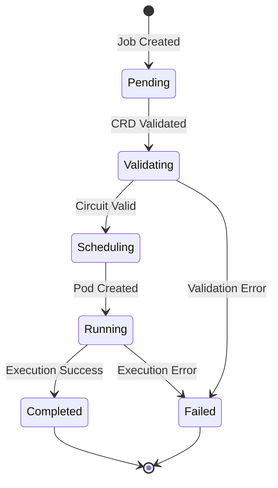

# Quick Start Guide

Get up and running with Qiskit Operator in under 5 minutes!

## Prerequisites

Before you begin, ensure you have:

- [x] Kubernetes cluster (1.24+) - [Kind](https://kind.sigs.k8s.io/), [Minikube](https://minikube.sigs.k8s.io/), or cloud cluster
- [x] [kubectl](https://kubernetes.io/docs/tasks/tools/) configured
- [x] [Helm 3](https://helm.sh/docs/intro/install/) installed (optional, but recommended)

## Installation

=== "Helm (Recommended)"

    ```bash
    # Add the Qiskit Operator Helm repository
    helm repo add qiskit-operator https://quantum-operator.github.io/qiskit-operator
    helm repo update

    # Install the operator
    helm install qiskit-operator qiskit-operator/qiskit-operator \
      --namespace qiskit-operator-system \
      --create-namespace

    # Verify installation
    kubectl get pods -n qiskit-operator-system
    ```

=== "kubectl"

    ```bash
    # Install CRDs
    kubectl apply -f https://raw.githubusercontent.com/quantum-operator/qiskit-operator/main/config/crd/bases/

    # Install the operator
    kubectl apply -f https://raw.githubusercontent.com/quantum-operator/qiskit-operator/main/config/manager/manager.yaml

    # Verify installation
    kubectl get pods -n qiskit-operator-system
    ```

=== "Local Development (Kind)"

    ```bash
    # Create Kind cluster
    kind create cluster --name qiskit-dev

    # Clone repository
    git clone https://github.com/quantum-operator/qiskit-operator
    cd qiskit-operator

    # Install CRDs
    make install

    # Run operator locally
    make run
    ```

## Your First Quantum Job

### Step 1: Create a Simple Bell State Circuit

Create a file named `bell-state.yaml`:

```yaml title="bell-state.yaml"
apiVersion: quantum.io/v1
kind: QiskitJob
metadata:
  name: my-first-quantum-job
  namespace: default
spec:
  backend:
    type: local_simulator
  
  circuit:
    source: inline
    code: |
      from qiskit import QuantumCircuit
      
      # Create a Bell state - the simplest entangled state
      qc = QuantumCircuit(2, 2)
      qc.h(0)           # Apply Hadamard gate to qubit 0
      qc.cx(0, 1)       # Apply CNOT gate
      qc.measure([0, 1], [0, 1])  # Measure both qubits
  
  execution:
    shots: 1024
    optimizationLevel: 1
  
  output:
    type: configmap
    location: my-first-results
```

### Step 2: Submit the Job

```bash
# Apply the job
kubectl apply -f bell-state.yaml

# Watch the job progress
kubectl get qiskitjob my-first-quantum-job -w
```

You should see output like:

```
NAME                    PHASE        BACKEND           COST     AGE
my-first-quantum-job   Pending      local_simulator   $0.00    1s
my-first-quantum-job   Validating   local_simulator   $0.00    2s
my-first-quantum-job   Scheduling   local_simulator   $0.00    3s
my-first-quantum-job   Running      local_simulator   $0.00    5s
my-first-quantum-job   Completed    local_simulator   $0.00    25s
```

### Step 3: View the Results

```bash
# Get the results
kubectl get configmap my-first-results -o yaml
```

Expected output:

```yaml
apiVersion: v1
kind: ConfigMap
metadata:
  name: my-first-results
data:
  counts: |
    {
      "00": 512,
      "11": 512
    }
  metadata: |
    {
      "shots": 1024,
      "backend": "local_simulator",
      "execution_time": 0.234,
      "qubits": 2,
      "depth": 3
    }
```

!!! success "Congratulations! 🎉"
    You just ran your first quantum circuit on Kubernetes! The Bell state creates quantum entanglement, where measuring one qubit instantly determines the state of the other.

## Understanding the Results

The Bell state circuit produces a **maximally entangled state**:

| Result | Count | Percentage | Meaning |
|--------|-------|------------|---------|
| `00` | ~512 | ~50% | Both qubits measured as 0 |
| `11` | ~512 | ~50% | Both qubits measured as 1 |

Notice we never get `01` or `10` - this is quantum entanglement in action!

## Job Lifecycle



## What's Next?

Now that you've run your first quantum job, explore more:

<div class="grid cards" markdown>

-   :material-school:{ .lg .middle } **Learn More**

    ---

    Explore quantum algorithms and concepts

    [:octicons-arrow-right-24: Tutorials](../tutorials/index.md)

-   :material-code-braces:{ .lg .middle } **More Examples**

    ---

    Try Grover's search, VQE, and more

    [:octicons-arrow-right-24: Examples](../reference/examples.md)

-   :material-server:{ .lg .middle } **Production Setup**

    ---

    Deploy to production with best practices

    [:octicons-arrow-right-24: Deployment Guide](../deployment/production.md)

-   :material-cloud:{ .lg .middle } **Real Quantum Hardware**

    ---

    Connect to IBM Quantum Platform

    [:octicons-arrow-right-24: IBM Quantum Setup](../backends/ibm-quantum.md)

</div>

## Common Next Steps

### 1. Try More Complex Circuits

```yaml
apiVersion: quantum.io/v1
kind: QiskitJob
metadata:
  name: grover-search
spec:
  backend:
    type: local_simulator
  circuit:
    source: inline
    code: |
      from qiskit import QuantumCircuit
      
      # Grover's algorithm - quantum search
      qc = QuantumCircuit(3)
      qc.h([0, 1, 2])       # Superposition
      # Oracle for |111⟩
      qc.ccx(0, 1, 2)
      qc.h([0, 1, 2])
      qc.x([0, 1, 2])
      qc.h(2)
      qc.ccx(0, 1, 2)
      qc.h(2)
      qc.x([0, 1, 2])
      qc.h([0, 1, 2])
      qc.measure_all()
  execution:
    shots: 8192
```

### 2. Set Up IBM Quantum Access

```bash
# Create secret with your IBM Quantum API key
kubectl create secret generic ibm-quantum-credentials \
  --from-literal=api-key=YOUR_API_KEY
```

Then modify your job to use IBM Quantum:

```yaml hl_lines="6-7"
spec:
  backend:
    type: ibm_quantum
    name: ibm_brisbane
  credentials:
    secretRef:
      name: ibm-quantum-credentials
```

### 3. Add Cost Management

```yaml
apiVersion: quantum.io/v1
kind: QiskitBudget
metadata:
  name: team-budget
spec:
  limit: "$500.00"
  period: monthly
  alerts:
    - threshold: 80
      channels: ["slack"]
```

### 4. Monitor with Prometheus

```bash
# Install Prometheus monitoring
kubectl apply -f config/prometheus/

# Access Grafana dashboard
kubectl port-forward -n monitoring svc/grafana 3000:3000
```

## Troubleshooting

??? question "Job stuck in Pending"
    
    Check the operator logs:
    ```bash
    kubectl logs -n qiskit-operator-system deployment/qiskit-operator-controller -f
    ```

??? question "Pod fails to start"
    
    Verify the executor image is available:
    ```bash
    kubectl describe pod qiskit-job-my-first-quantum-job
    ```

??? question "Circuit validation fails"
    
    Check validation service logs:
    ```bash
    kubectl logs -n qiskit-operator-system deployment/qiskit-validation-service
    ```

??? question "Results not appearing"
    
    Verify the output configuration:
    ```bash
    kubectl describe qiskitjob my-first-quantum-job
    kubectl get pods -l job-name=my-first-quantum-job
    ```

## Need Help?

- 📖 [Full Documentation](../user-guide/index.md)
- 💬 [GitHub Discussions](https://github.com/quantum-operator/qiskit-operator/discussions)
- 🐛 [Report Issues](https://github.com/quantum-operator/qiskit-operator/issues)
- 💼 [Slack Community](https://quantum-operator.slack.com)

---

**Next Steps**: Learn about [installation options](installation.md) or jump into [tutorials](../tutorials/index.md)!

