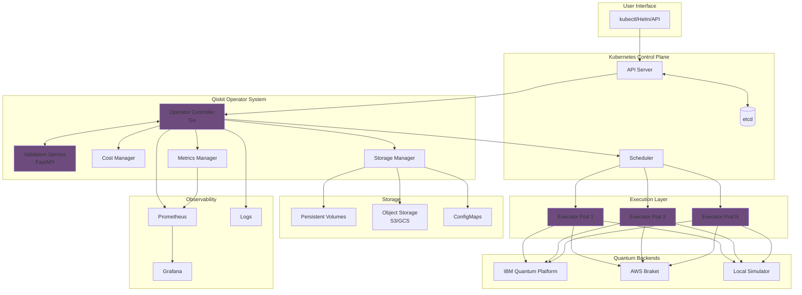
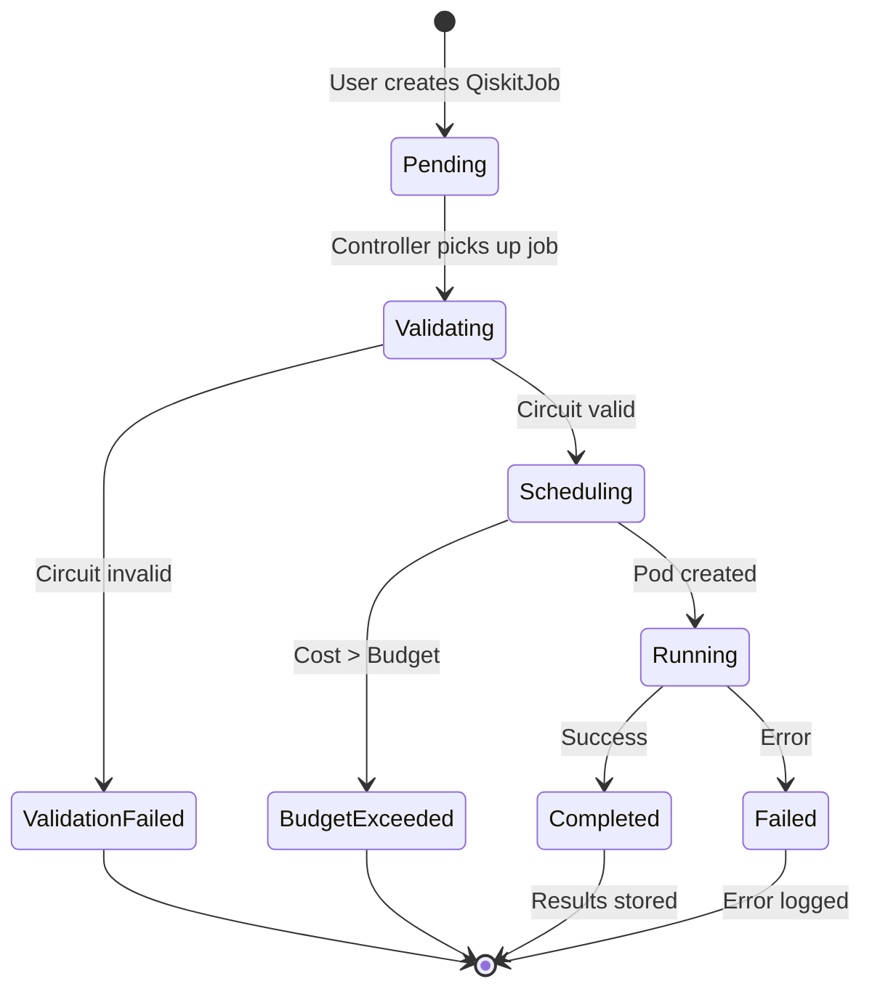
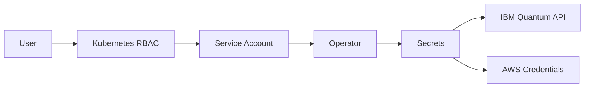

# Architecture

This document describes the architecture of Qiskit Operator and how its components work together.

## Overview

Qiskit Operator follows the Kubernetes Operator pattern to manage quantum computing workloads. It extends Kubernetes with custom resources and controllers specifically designed for quantum circuit execution.



## Components

### 1. Operator Controller (Go)

The main controller that watches for Custom Resource Definitions and reconciles them.

**Responsibilities:**
- Watch for QiskitJob, QiskitBackend, QiskitSession, QiskitBudget resources
- Validate resource specifications
- Coordinate with validation service
- Select optimal quantum backend
- Create and manage executor pods
- Track job lifecycle and status
- Enforce budget constraints
- Emit metrics and logs

**Technology Stack:**
- Language: Go 1.21+
- Framework: Kubebuilder 3.x
- Libraries: controller-runtime, client-go

**Docker Image:** `sudeshmu/qiskit-operator:controller-latest`

**Resource Requirements:**
```yaml
resources:
  requests:
    cpu: 100m
    memory: 128Mi
  limits:
    cpu: 500m
    memory: 256Mi
```

---

### 2. Validation Service (Python/FastAPI)

A REST API service that validates quantum circuits and extracts circuit properties.

**Responsibilities:**
- Validate Python syntax
- Validate Qiskit circuit code
- Extract circuit metrics (qubits, depth, gates)
- Check backend compatibility
- Estimate execution time and cost
- Generate circuit hash for caching

**Technology Stack:**
- Language: Python 3.11
- Framework: FastAPI + Uvicorn
- Libraries: Qiskit, NumPy, SciPy

**Docker Image:** `sudeshmu/qiskit-operator:validation-latest`

**Endpoints:**
```
POST   /validate        - Validate circuit code
GET    /health          - Health check
GET    /metrics         - Prometheus metrics
```

**Resource Requirements:**
```yaml
resources:
  requests:
    cpu: 500m
    memory: 1Gi
  limits:
    cpu: 2000m
    memory: 2Gi
```

---

### 3. Executor Pods (Python)

Ephemeral pods that execute quantum circuits on selected backends.

**Responsibilities:**
- Load circuit code from job spec
- Initialize quantum backend (IBM Quantum, AWS Braket, Local Simulator)
- Execute quantum circuit
- Retrieve and format results
- Store results in configured location
- Report execution metrics

**Technology Stack:**
- Language: Python 3.11
- Libraries: Qiskit, qiskit-ibm-runtime, boto3 (for AWS)

**Docker Image:** `sudeshmu/qiskit-operator:executor-latest`

**Lifecycle:**
1. Created by operator controller
2. Pulls circuit code from job spec
3. Executes on quantum backend
4. Stores results
5. Pod completes (not deleted automatically)

---

### 4. Cost Manager

Manages budget tracking and cost optimization.

**Responsibilities:**
- Estimate job costs before execution
- Track actual costs after execution
- Enforce budget limits
- Provide cost optimization recommendations
- Generate cost reports

**Features:**
- Per-namespace budgets
- Cost center allocation
- Backend cost comparison
- Cost alerts and notifications

---

### 5. Storage Manager

Handles result storage across multiple backends.

**Supported Storage Types:**
- **ConfigMaps**: For small results (< 1MB)
- **Persistent Volumes**: For large results
- **S3/GCS**: For cloud-native storage
- **Custom**: Extensible storage backend

**Features:**
- Automatic format conversion (JSON, Pickle, QPY)
- Compression for large results
- Retention policies
- Backup and archival

---

### 6. Metrics Manager

Collects and exposes metrics for monitoring.

**Metrics Categories:**
- Job metrics (success rate, duration, cost)
- Backend metrics (utilization, queue time)
- Circuit metrics (qubits, depth, gates)
- System metrics (API latency, error rate)

**Integration:**
- Prometheus scraping
- Grafana dashboards
- Custom alerting rules

---

## Custom Resource Definitions (CRDs)

### QiskitJob

Represents a quantum circuit execution job.

```yaml
apiVersion: quantum.io/v1
kind: QiskitJob
```

**Key Fields:**
- `backend`: Backend configuration
- `circuit`: Circuit code and source
- `execution`: Execution parameters (shots, optimization)
- `budget`: Cost constraints
- `output`: Result storage configuration

**Status Phases:**
- Pending → Validating → Scheduling → Running → Completed/Failed

---

### QiskitBackend

Represents a quantum backend configuration.

```yaml
apiVersion: quantum.io/v1
kind: QiskitBackend
```

**Key Fields:**
- `type`: Backend type (IBM, AWS, local)
- `credentials`: Authentication details
- `capabilities`: Supported features
- `pricing`: Cost information

---

### QiskitSession

Manages IBM Quantum Runtime sessions for iterative algorithms.

```yaml
apiVersion: quantum.io/v1
kind: QiskitSession
```

**Key Fields:**
- `backend`: Target backend
- `maxTime`: Maximum session duration
- `mode`: dedicated or shared

---

### QiskitBudget

Defines cost constraints and quotas.

```yaml
apiVersion: quantum.io/v1
kind: QiskitBudget
```

**Key Fields:**
- `limit`: Maximum spend amount
- `period`: Budget period (daily, weekly, monthly)
- `alerts`: Alert thresholds

---

## Job Lifecycle



### Detailed Flow

1. **Job Creation**
   - User submits QiskitJob YAML
   - Kubernetes API validates schema
   - Job enters "Pending" phase

2. **Validation**
   - Controller sends circuit to validation service
   - Validation service checks Python syntax
   - Validation service validates Qiskit code
   - Circuit metrics extracted
   - Job transitions to "Validating" phase

3. **Backend Selection**
   - Controller queries available backends
   - Cost estimation performed
   - Budget check executed
   - Optimal backend selected based on weights
   - Job transitions to "Scheduling" phase

4. **Pod Creation**
   - Controller creates executor pod
   - Pod pulls executor image
   - Circuit code injected via env vars or configmap
   - Credentials mounted from secrets
   - Job transitions to "Running" phase

5. **Circuit Execution**
   - Executor initializes quantum backend
   - Circuit executed with specified shots
   - Results retrieved
   - Metrics collected

6. **Result Storage**
   - Results formatted (JSON, Pickle, etc.)
   - Stored in configured location
   - Status updated with result reference

7. **Completion**
   - Job marked as "Completed"
   - Cost calculated and recorded
   - Metrics emitted
   - Alerts sent if configured

---

## Communication Flow

### Controller ↔ Validation Service

```
Controller:
  POST /validate
  {
    "code": "from qiskit import ...",
    "backend_name": "ibm_brisbane",
    "optimization_level": 3
  }

Validation Service:
  200 OK
  {
    "valid": true,
    "qubits": 5,
    "depth": 12,
    "gates": {"h": 5, "cx": 10},
    "estimated_time": 2.5,
    "hash": "a3f5..."
  }
```

### Controller ↔ Executor Pod

Communication via Kubernetes API:
- Circuit code: ConfigMap or Environment Variable
- Credentials: Secret mount
- Results: ConfigMap, PVC, or S3

### Executor ↔ Quantum Backend

```
Local Simulator:
  - Direct Qiskit Aer execution
  - No network required

IBM Quantum:
  - REST API via qiskit-ibm-runtime
  - Authentication with API key
  - Job submission and polling

AWS Braket:
  - AWS SDK (boto3)
  - IAM authentication
  - S3 for result retrieval
```

---

## Security Architecture

### Authentication & Authorization



**RBAC Roles:**
- `qiskitjob-admin`: Full job management
- `qiskitjob-editor`: Create and update jobs
- `qiskitjob-viewer`: Read-only access

**Secret Management:**
- Backend credentials stored in Kubernetes Secrets
- Mounted into executor pods as volumes
- Never logged or exposed in status

### Pod Security

- **Non-root execution**: All containers run as non-root
- **Read-only root filesystem**: Where possible
- **Seccomp profiles**: Applied for syscall filtering
- **Network policies**: Restrict pod-to-pod communication
- **Resource limits**: Prevent resource exhaustion

---

## Scalability

### Horizontal Scaling

**Controller:**
- Leader election for multiple replicas
- Shared workload distribution
- High availability with 3+ replicas

**Validation Service:**
- Stateless design
- Load balancing with Kubernetes Service
- Auto-scaling based on CPU/memory

**Executor Pods:**
- One pod per job (default)
- Parallel execution of multiple jobs
- Resource quota enforcement

### Performance Characteristics

| Component | Throughput | Latency |
|-----------|-----------|---------|
| Controller | 100 jobs/sec | <100ms |
| Validation | 50 validations/sec | ~350ms |
| Executor | 1 job/pod | Varies by backend |

---

## Observability

### Metrics (Prometheus)

```
# Job metrics
qiskit_jobs_total{phase="Completed"}
qiskit_jobs_duration_seconds
qiskit_jobs_cost_dollars

# Circuit metrics
qiskit_circuit_qubits
qiskit_circuit_depth
qiskit_circuit_gates_total

# Backend metrics
qiskit_backend_queue_time_seconds
qiskit_backend_execution_time_seconds
```

### Logging

Structured JSON logging with fields:
- `job_name`: QiskitJob name
- `namespace`: Kubernetes namespace
- `phase`: Current job phase
- `backend`: Selected backend
- `timestamp`: ISO8601 timestamp

### Tracing

OpenTelemetry integration for distributed tracing:
- Job creation → Validation → Execution → Completion
- Span timing for performance analysis

---

## High Availability

### Controller HA

```yaml
apiVersion: apps/v1
kind: Deployment
metadata:
  name: qiskit-operator-controller
spec:
  replicas: 3
  strategy:
    type: RollingUpdate
```

- **Leader Election**: Only one active controller
- **Automatic Failover**: <30 seconds
- **Zero Downtime Updates**: Rolling deployment

### Validation Service HA

```yaml
apiVersion: apps/v1
kind: Deployment
metadata:
  name: qiskit-validation
spec:
  replicas: 3
```

- **Load Balancing**: Kubernetes Service
- **Health Checks**: Liveness and readiness probes
- **Auto-scaling**: HPA based on CPU

### Data Persistence

- **ETCD**: Kubernetes state (CRDs)
- **Persistent Volumes**: Long-term result storage
- **Backup Strategy**: Regular etcd backups

---

## Extensibility

### Custom Backends

Implement the `Backend` interface:

```go
type Backend interface {
    Submit(circuit string, options ExecutionOptions) (JobID, error)
    GetStatus(jobID JobID) (Status, error)
    GetResults(jobID JobID) (Results, error)
    GetCost(circuit Circuit) (Cost, error)
}
```

### Custom Storage

Implement the `Storage` interface:

```go
type Storage interface {
    Store(key string, data []byte) error
    Retrieve(key string) ([]byte, error)
    Delete(key string) error
}
```

### Webhooks

Admission webhooks for validation and mutation:
- Validate job specs before admission
- Mutate jobs with defaults
- Enforce organizational policies

---

## Technology Stack

| Layer | Technology |
|-------|-----------|
| **Orchestration** | Kubernetes 1.24+ |
| **Operator Framework** | Kubebuilder 3.x |
| **Controller** | Go 1.21, controller-runtime |
| **Validation** | Python 3.11, FastAPI, Qiskit |
| **Executor** | Python 3.11, Qiskit, qiskit-ibm-runtime |
| **Metrics** | Prometheus, Grafana |
| **Storage** | etcd, PVC, S3/GCS |
| **CI/CD** | GitHub Actions, Docker |

---

## Design Principles

1. **Cloud-Native**: Leverage Kubernetes primitives
2. **Declarative**: Desired state via CRDs
3. **Extensible**: Plugin architecture for backends
4. **Observable**: Rich metrics and logging
5. **Secure**: RBAC, secrets, pod security
6. **Resilient**: Error handling and retries
7. **Cost-Aware**: Built-in cost management
8. **Developer-Friendly**: Simple YAML interface

---

## Next Steps

- [Deployment Guide](../deployment/index.md)
- [Development Guide](../development/index.md)
- [API Reference](../reference/index.md)

