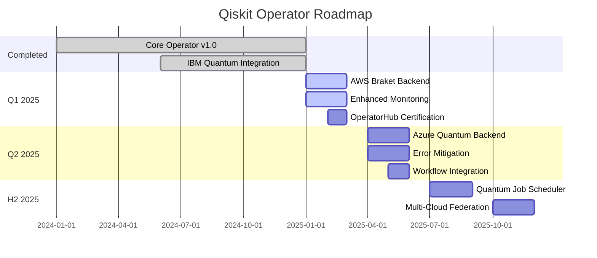

# Roadmap

Qiskit Operator is actively developed with exciting features planned for future releases.

## Current Status (v1.0)

### ✅ Completed Features

- **Core Operator**
  - [x] Custom Resource Definitions (QiskitJob, QiskitBackend, QiskitSession, QiskitBudget)
  - [x] Controller reconciliation loop
  - [x] Circuit validation service
  - [x] Multi-platform support (amd64, arm64)

- **Backend Support**
  - [x] Local Qiskit Aer simulator
  - [x] IBM Quantum Platform integration
  - [x] IBM Quantum Runtime sessions
  - [x] Backend selection algorithm

- **Features**
  - [x] Cost management and budgeting
  - [x] Multiple circuit sources (inline, ConfigMap, Git, URL)
  - [x] Flexible output storage (ConfigMap, PVC, S3, GCS)
  - [x] Circuit optimization (levels 0-3)
  - [x] RBAC integration
  - [x] Prometheus metrics
  - [x] Structured logging

- **Deployment**
  - [x] Docker images on Docker Hub
  - [x] Helm charts
  - [x] Production-ready configuration
  - [x] Comprehensive documentation

## Near Term (Q1 2025)

### 🚧 In Progress

- **AWS Braket Backend** (Beta)
  - [ ] Basic integration
  - [ ] Device support (IonQ, Rigetti, OQC)
  - [ ] Cost tracking
  - [ ] Session management

- **Enhanced Monitoring**
  - [ ] Pre-built Grafana dashboards
  - [ ] Alert rules templates
  - [ ] Job execution timeline visualization
  - [ ] Cost breakdown dashboard

- **Operator Hub**
  - [ ] OperatorHub.io certification
  - [ ] Red Hat OpenShift certification
  - [ ] Operator bundle creation

### 📋 Planned

- **Developer Experience**
  - [ ] CLI tool for job management
  - [ ] VS Code extension
  - [ ] Circuit debugging tools
  - [ ] Local testing framework

- **Documentation**
  - [ ] Video tutorials
  - [ ] Interactive examples
  - [ ] Webinar series
  - [ ] Case studies

## Medium Term (Q2 2025)

### 🎯 Major Features

- **Azure Quantum Backend**
  - [ ] Azure Quantum integration
  - [ ] Multiple provider support
  - [ ] Hybrid quantum-classical workflows

- **Advanced Error Mitigation**
  - [ ] Zero-noise extrapolation
  - [ ] Probabilistic error cancellation
  - [ ] Custom error mitigation strategies
  - [ ] Noise characterization

- **Workflow Integration**
  - [ ] Argo Workflows integration
  - [ ] Tekton Pipeline support
  - [ ] Apache Airflow provider
  - [ ] Kubeflow Pipelines integration

- **Cost Optimization**
  - [ ] ML-based cost prediction
  - [ ] Automatic backend recommendation
  - [ ] Spot instance support for simulators
  - [ ] Reserved capacity management

### 📊 Performance & Scalability

- **Batch Processing**
  - [ ] Batch job submission
  - [ ] Job arrays support
  - [ ] Parameter sweeps
  - [ ] Parallel execution optimization

- **Caching & Optimization**
  - [ ] Circuit compilation caching
  - [ ] Result caching
  - [ ] Smart circuit reuse
  - [ ] Execution plan optimization

## Long Term (2025+)

### 🔮 Future Vision

- **Quantum Job Scheduler**
  - [ ] Advanced scheduling algorithms
  - [ ] Resource reservation
  - [ ] Priority queues
  - [ ] Fair-share scheduling
  - [ ] Gang scheduling for multi-job workflows

- **Quantum DevOps**
  - [ ] Quantum circuit CI/CD patterns
  - [ ] Automated regression testing
  - [ ] Performance benchmarking suite
  - [ ] A/B testing for quantum circuits

- **Multi-Cloud & Hybrid**
  - [ ] Multi-cloud backend federation
  - [ ] Cross-cloud job migration
  - [ ] Hybrid quantum-classical optimization
  - [ ] Edge quantum computing support

- **Enterprise Features**
  - [ ] Multi-tenancy enhancements
  - [ ] Chargeback reporting
  - [ ] SLA management
  - [ ] Compliance auditing
  - [ ] Data residency controls

- **Advanced Quantum Features**
  - [ ] Dynamic circuit support
  - [ ] Real-time classical feedback
  - [ ] Quantum error correction primitives
  - [ ] Variational algorithm framework

- **AI/ML Integration**
  - [ ] Quantum machine learning workflows
  - [ ] AutoML for quantum circuits
  - [ ] Neural architecture search for quantum
  - [ ] Quantum kernel methods

## Community Requests

Vote for features you'd like to see! Visit our [GitHub Discussions](https://github.com/quantum-operator/qiskit-operator/discussions) to:

- 👍 Upvote existing feature requests
- 💡 Submit new ideas
- 💬 Discuss implementation approaches
- 🤝 Volunteer to contribute

## Release Schedule

We follow semantic versioning and aim for:

- **Major releases**: Annually (breaking changes)
- **Minor releases**: Quarterly (new features)
- **Patch releases**: Monthly (bug fixes)

## Timeline

## How to Influence the Roadmap

### 1. GitHub Discussions

Share your use cases and requirements:
- [Feature Requests](https://github.com/quantum-operator/qiskit-operator/discussions/categories/feature-requests)
- [Ideas](https://github.com/quantum-operator/qiskit-operator/discussions/categories/ideas)

### 2. GitHub Issues

File detailed feature requests:
- Use the feature request template
- Include use case and motivation
- Describe desired behavior

### 3. Contribute

Help build the features:
- Pick up issues labeled "help wanted"
- Submit pull requests
- Review others' PRs
- Write documentation

### 4. Partnerships

Enterprise partnerships can accelerate specific features:
- Email: [enterprise@quantum-operator.io](mailto:enterprise@quantum-operator.io)

## Versioning Policy

### Major Versions (x.0.0)

- Breaking API changes
- Major architectural changes
- Deprecated feature removal

### Minor Versions (1.x.0)

- New features
- Backend additions
- Non-breaking enhancements

### Patch Versions (1.0.x)

- Bug fixes
- Security patches
- Performance improvements

## Deprecation Policy

When deprecating features:

1. **Announce** in release notes
2. **Mark deprecated** in code and docs
3. **Maintain** for 2 major versions
4. **Remove** in 3rd major version

Example:
- Deprecated in v1.0
- Maintained in v1.x and v2.x
- Removed in v3.0

## Experimental Features

Features marked as **experimental**:

- May change without notice
- Not covered by stability guarantees
- Valuable for early feedback
- Use at your own risk in production

Current experimental features:
- AWS Braket backend (beta)
- Advanced error mitigation
- ML-based optimization

## Feature Stability Levels

### Alpha (Experimental)

- Not recommended for production
- May change significantly
- Limited support

### Beta

- API may change with notice
- Suitable for non-critical workloads
- Community support

### Stable

- Production-ready
- API stability guarantee
- Full support

## Success Metrics

We measure success by:

- **Adoption**: Active installations
- **Reliability**: Job success rate >99%
- **Performance**: Job submission latency <100ms
- **Community**: Contributors and issue engagement
- **Enterprise**: Production deployments

## Stay Updated

- 📧 [Mailing List](https://quantum-operator.io/newsletter)
- 🐦 [Twitter](https://twitter.com/quantumoperator)
- 💼 [LinkedIn](https://linkedin.com/company/quantum-operator)
- 📺 [YouTube](https://youtube.com/@quantumoperator)

## Questions?

Have questions about the roadmap?

- 💬 [GitHub Discussions](https://github.com/quantum-operator/qiskit-operator/discussions)
- 💼 [Slack Community](https://quantum-operator.slack.com)

---

**Last Updated**: November 2025  
**Next Review**: February 2025

*Roadmap subject to change based on community feedback and technical constraints.*

