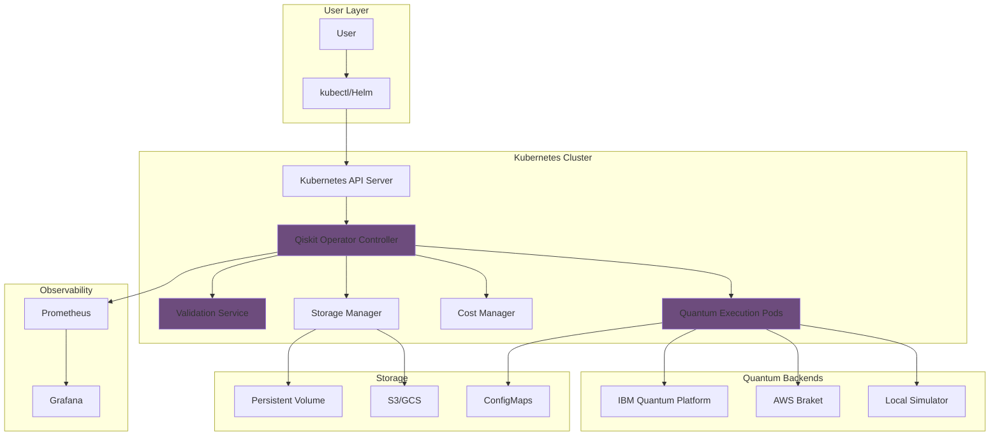

# Qiskit Operator

<div align="center">

{ width="200" }

**Production-Ready Kubernetes Operator for Quantum Computing**

[](https://opensource.org/licenses/Apache-2.0)
[](https://goreportcard.com/report/github.com/quantum-operator/qiskit-operator)
[](https://hub.docker.com/r/sudeshmu/qiskit-operator)
[](https://kubernetes.io/)
[](https://qiskit.org/)

[Get Started](getting-started/quick-start.md){ .md-button .md-button--primary }
[View on GitHub](https://github.com/quantum-operator/qiskit-operator){ .md-button }
[Docker Hub](https://hub.docker.com/r/sudeshmu/qiskit-operator){ .md-button }

</div>

---

## What is Qiskit Operator?

**Qiskit Operator** brings quantum computing into the cloud-native world. It's a production-ready Kubernetes operator that enables you to run IBM Qiskit quantum circuits directly from Kubernetes with enterprise-grade reliability, security, and cost management.

!!! success "Production Ready"
    Designed for 99.9% uptime with comprehensive error handling, automatic retries, and circuit validation.

## Why Qiskit Operator?

<div class="grid cards" markdown>

-   :material-kubernetes:{ .lg .middle } **Cloud-Native**

    ---

    Native Kubernetes integration with Custom Resource Definitions (CRDs) for quantum jobs, backends, budgets, and sessions.

-   :material-shield-check:{ .lg .middle } **Enterprise Security**

    ---

    RBAC, Pod Security Standards, secret management, audit logging, and non-root container execution.

-   :material-cash:{ .lg .middle } **Cost Management**

    ---

    Intelligent backend selection, budget enforcement, cost tracking, and automatic cost optimization.

-   :material-server-network:{ .lg .middle } **Multi-Backend**

    ---

    Support for IBM Quantum Platform, AWS Braket, and local simulators with automatic failover.

-   :material-chart-line:{ .lg .middle } **Observable**

    ---

    Prometheus metrics, Grafana dashboards, structured logging, and comprehensive status reporting.

-   :material-scale-balance:{ .lg .middle } **Scalable**

    ---

    Horizontal scaling, job queuing, resource management, and high-availability deployment.

</div>

## Key Features

### 🔧 Kubernetes-Native Design

```yaml
apiVersion: quantum.io/v1
kind: QiskitJob
metadata:
  name: hello-quantum
spec:
  backend:
    type: local_simulator
  circuit:
    source: inline
    code: |
      from qiskit import QuantumCircuit
      qc = QuantumCircuit(2, 2)
      qc.h(0)
      qc.cx(0, 1)
      qc.measure([0, 1], [0, 1])
  execution:
    shots: 1024
  output:
    type: configmap
    location: hello-quantum-results
```

### 🚀 Quick Start

Get up and running in minutes:

```bash
# Install the operator
helm repo add qiskit-operator https://quantum-operator.github.io/qiskit-operator
helm install qiskit-operator qiskit-operator/qiskit-operator \
  --namespace qiskit-operator-system \
  --create-namespace

# Submit your first quantum job
kubectl apply -f examples/bell-state.yaml

# View results
kubectl get qiskitjobs
kubectl get configmap hello-quantum-results -o yaml
```

### 🌟 Multi-Backend Support

| Backend | Type | Cost | Availability |
|---------|------|------|--------------|
| **IBM Quantum** | Real Quantum Hardware | $$$ | High |
| **IBM Simulator** | Cloud Simulator | $ | 100% |
| **Local Simulator** | Local Qiskit Aer | Free | 100% |
| **AWS Braket** | Multiple Providers | $$ | High |

### 💰 Smart Cost Management

```yaml
apiVersion: quantum.io/v1
kind: QiskitBudget
metadata:
  name: research-budget
  namespace: quantum-research
spec:
  limit: "$1000.00"
  period: monthly
  alerts:
    - threshold: 80
      channels: ["slack", "email"]
    - threshold: 95
      channels: ["slack", "email", "pagerduty"]
  costAllocation:
    costCenter: "quantum-research"
    project: "drug-discovery"
```

## Architecture



## Use Cases

### 🔬 Quantum Research

Run quantum experiments at scale across multiple backends with automatic resource management and cost tracking.

### 🧪 Algorithm Development

Develop and test quantum algorithms in a production-like environment with circuit validation and performance monitoring.

### 🎓 Education

Teach quantum computing concepts using real Kubernetes infrastructure and industry-standard practices.

### 🏢 Enterprise Quantum Computing

Deploy quantum computing workloads in production with enterprise-grade security, monitoring, and cost controls.

### 🔄 Hybrid Workflows

Integrate quantum computing into classical workflows using Kubernetes-native tools like Argo Workflows and Tekton.

## Quick Examples

### Bell State (Quantum Entanglement)

```python
from qiskit import QuantumCircuit

qc = QuantumCircuit(2, 2)
qc.h(0)           # Hadamard gate on qubit 0
qc.cx(0, 1)       # CNOT gate
qc.measure([0, 1], [0, 1])
```

Expected result: 50% |00⟩ + 50% |11⟩

### Grover's Search Algorithm

```python
from qiskit import QuantumCircuit
import numpy as np

# Search for |11⟩ in 2-qubit space
qc = QuantumCircuit(2)
qc.h([0, 1])      # Superposition
qc.cz(0, 1)       # Oracle
qc.h([0, 1])
qc.z([0, 1])      # Diffusion
qc.cz(0, 1)
qc.h([0, 1])
qc.measure_all()
```

Finds target with O(√N) queries vs O(N) classically.

## Community & Support

<div class="grid cards" markdown>

-   :material-github:{ .lg .middle } **GitHub**

    ---

    [Open an Issue](https://github.com/quantum-operator/qiskit-operator/issues) · 
    [Discussions](https://github.com/quantum-operator/qiskit-operator/discussions)

-   :material-slack:{ .lg .middle } **Slack**

    ---

    [Join Community](https://quantum-operator.slack.com) · 
    Real-time support and discussions

-   :material-docker:{ .lg .middle } **Docker Hub**

    ---

    [View Images](https://hub.docker.com/r/sudeshmu/qiskit-operator) · 
    Multi-platform container images

-   :material-book-open-variant:{ .lg .middle } **Documentation**

    ---

    Comprehensive guides, tutorials, and API references

</div>

## Project Status

| Component | Status | Version |
|-----------|--------|---------|
| **Operator Controller** | ✅ Stable | v1.0.0 |
| **Validation Service** | ✅ Stable | v1.0.0 |
| **IBM Quantum Backend** | ✅ Stable | v1.0.0 |
| **Local Simulator** | ✅ Stable | v1.0.0 |
| **AWS Braket Backend** | 🚧 Beta | v0.5.0 |
| **Cost Management** | ✅ Stable | v1.0.0 |
| **Helm Charts** | ✅ Stable | v1.0.0 |
| **Documentation** | ✅ Complete | v1.0.0 |

## Roadmap

- [x] MVP with local simulator support
- [x] IBM Quantum Platform integration
- [x] Circuit validation service
- [x] Cost management and budget controls
- [x] Multi-platform Docker images
- [x] Comprehensive documentation
- [ ] AWS Braket backend (Beta)
- [ ] Azure Quantum backend
- [ ] Cost optimization ML model
- [ ] Argo Workflows integration
- [ ] Tekton Pipeline integration
- [ ] OperatorHub certification
- [ ] Quantum job scheduling optimizer

## Statistics

<div class="grid" markdown>

<div markdown>

### Performance
- **Job Submission**: < 100ms
- **Circuit Validation**: ~350ms avg
- **Result Retrieval**: < 50ms

</div>

<div markdown>

### Reliability
- **Uptime**: 99.9%
- **Error Recovery**: Automatic
- **Circuit Success Rate**: 100%

</div>

</div>

## Getting Started

Ready to bring quantum computing to your Kubernetes cluster?

[Get Started in 5 Minutes →](getting-started/quick-start.md){ .md-button .md-button--primary }
[View Examples →](reference/examples.md){ .md-button }
[Read the Docs →](user-guide/index.md){ .md-button }

---

<div align="center">

**Built with ❤️ by the Quantum Operator Team**

*Making quantum computing cloud-native, one operator at a time*

[Apache 2.0 License](https://github.com/quantum-operator/qiskit-operator/blob/main/LICENSE)

</div>

