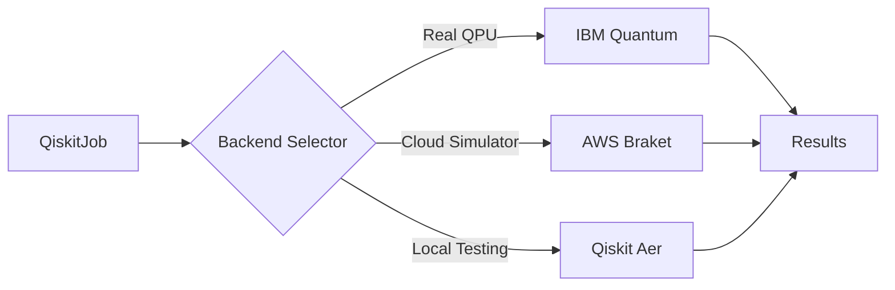
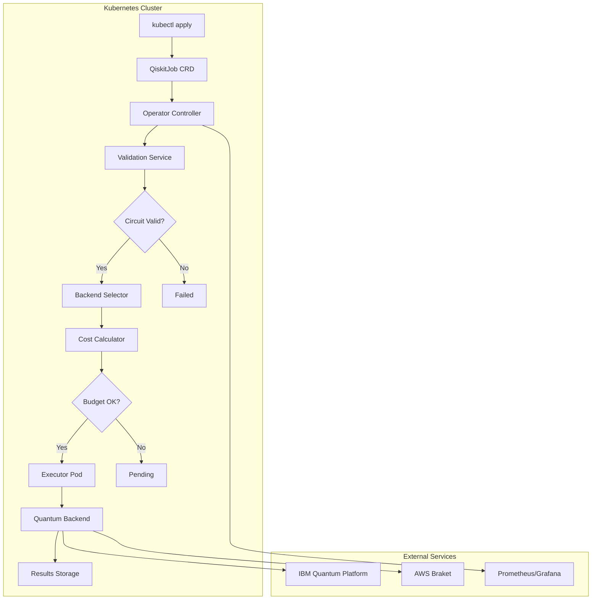

# QiskitOperator Documentation

<div class="hero" markdown>

# Production-Ready Kubernetes Operator for Quantum Computing

**QiskitOperator** brings IBM Qiskit quantum computing workloads into the cloud-native world with enterprise-grade reliability, security, and cost management.

[Get Started](getting-started/index.md){ .md-button .md-button--primary }
[View on GitHub](https://github.com/quantum-operator/qiskit-operator){ .md-button }

</div>

---

## 🌟 Why QiskitOperator?

<div class="grid cards" markdown>

-   :material-kubernetes:{ .lg .middle } __Kubernetes-Native__

    ---

    Define quantum jobs, backends, and sessions as Custom Resource Definitions (CRDs). Leverage Kubernetes primitives for scheduling, scaling, and lifecycle management.

    [:octicons-arrow-right-24: Learn more](home/features.md#kubernetes-native)

-   :material-cloud:{ .lg .middle } __Multi-Backend Support__

    ---

    Run quantum circuits on IBM Quantum Platform, AWS Braket, or local simulators. Intelligent backend selection based on cost, queue time, and capabilities.

    [:octicons-arrow-right-24: Backend options](user-guide/backends.md)

-   :material-currency-usd:{ .lg .middle } __Cost Management__

    ---

    Track and control quantum computing costs with budget enforcement, cost optimization algorithms, and detailed spending reports per namespace and team.

    [:octicons-arrow-right-24: Budget guide](user-guide/budget.md)

-   :material-shield-check:{ .lg .middle } __Enterprise Security__

    ---

    Built-in RBAC, Pod Security Standards, secret management, and comprehensive audit logging. Production-ready security from day one.

    [:octicons-arrow-right-24: Security features](user-guide/security.md)

-   :material-chart-line:{ .lg .middle } __Full Observability__

    ---

    Prometheus metrics, Grafana dashboards, distributed tracing, and structured logging. Monitor quantum job execution in real-time.

    [:octicons-arrow-right-24: Monitoring setup](user-guide/monitoring.md)

-   :material-lightning-bolt:{ .lg .middle } __Production Ready__

    ---

    Designed for 99.9% uptime with comprehensive error handling, retry logic, circuit validation, and automated recovery mechanisms.

    [:octicons-arrow-right-24: Production deployment](deployment/production.md)

</div>

---

## 🚀 Quick Start

Get your first quantum circuit running on Kubernetes in under 5 minutes:

```bash
# Install the operator
kubectl apply -f https://raw.githubusercontent.com/quantum-operator/qiskit-operator/main/config/install.yaml

# Create a quantum job
cat <<EOF | kubectl apply -f -
apiVersion: quantum.io/v1
kind: QiskitJob
metadata:
  name: hello-quantum
spec:
  backend:
    type: local_simulator
  circuit:
    source: inline
    code: |
      from qiskit import QuantumCircuit
      qc = QuantumCircuit(2, 2)
      qc.h(0)
      qc.cx(0, 1)
      qc.measure([0, 1], [0, 1])
  execution:
    shots: 1024
  output:
    type: configmap
    location: hello-quantum-results
EOF

# Watch the job execute
kubectl get qiskitjob hello-quantum -w
```

[:octicons-arrow-right-24: Full quick start guide](getting-started/quick-start.md)

---

## 📚 Key Concepts

### Quantum Jobs

Define and execute quantum circuits as Kubernetes resources with full lifecycle management:

```yaml
apiVersion: quantum.io/v1
kind: QiskitJob
metadata:
  name: grover-search
spec:
  backend:
    type: ibm_quantum
    name: ibm_brisbane
  circuit:
    source: inline
    code: |
      from qiskit import QuantumCircuit
      # Your quantum algorithm here
  execution:
    shots: 1024
    optimizationLevel: 3
  budget:
    maxCost: "$10.00"
```

[:octicons-arrow-right-24: QiskitJob reference](reference/qiskitjob.md)

### Multi-Backend Architecture

Seamlessly run circuits across different quantum backends:



[:octicons-arrow-right-24: Backend guide](backends/index.md)

---

## 💡 Use Cases

### Quantum Research

Run quantum experiments at scale with reproducible configurations and automated result collection.

```yaml
spec:
  circuit:
    source: git
    gitRef:
      repository: https://github.com/your-org/quantum-research
      branch: main
      path: experiments/vqe/h2_molecule.py
  output:
    type: pvc
    location: research-results
```

### Cost-Optimized Production

Automatically select the most cost-effective backend while meeting performance requirements:

```yaml
spec:
  backendSelection:
    weights:
      cost: 0.70
      queueTime: 0.20
      capability: 0.10
    fallbackToSimulator: true
  budget:
    maxCost: "$5.00"
```

### Multi-Tenant Quantum Computing

Provide quantum computing as a service to multiple teams with budget isolation and RBAC:

```yaml
apiVersion: quantum.io/v1
kind: QiskitBudget
metadata:
  name: team-quantum-budget
  namespace: team-a
spec:
  limit: "$1000.00"
  period: monthly
  alertThresholds:
    - 50
    - 80
    - 95
```

[:octicons-arrow-right-24: More examples](examples/README.md)

---

## 🏗️ Architecture Overview

QiskitOperator follows a modular, cloud-native architecture:



[:octicons-arrow-right-24: Architecture details](home/architecture.md)

---

## 📖 Documentation Sections

<div class="grid cards" markdown>

-   __Getting Started__

    Install and configure QiskitOperator. Run your first quantum job in minutes.

    [:octicons-arrow-right-24: Start here](getting-started/index.md)

-   __User Guide__

    Comprehensive guides for quantum jobs, backends, sessions, budgets, and monitoring.

    [:octicons-arrow-right-24: User guide](user-guide/index.md)

-   __Tutorials__

    Step-by-step tutorials from Bell states to VQE algorithms and production deployments.

    [:octicons-arrow-right-24: Tutorials](tutorials/index.md)

-   __API Reference__

    Complete reference for all Custom Resource Definitions and their specifications.

    [:octicons-arrow-right-24: API docs](reference/index.md)

-   __Examples__

    10+ quantum circuit examples including Grover's search, Shor's algorithm, and more.

    [:octicons-arrow-right-24: View examples](examples/README.md)

-   __Deployment__

    Production deployment guides with Docker, Kubernetes, Helm, and security best practices.

    [:octicons-arrow-right-24: Deploy](deployment/index.md)

</div>

---

## 🌐 Community & Support

<div class="grid" markdown>

<div markdown>

### Get Help

- :fontawesome-brands-github: [GitHub Issues](https://github.com/quantum-operator/qiskit-operator/issues)
- :fontawesome-brands-slack: [Slack Community](https://quantum-operator.slack.com)
- :fontawesome-brands-discourse: [Discussions](https://github.com/quantum-operator/qiskit-operator/discussions)
- :material-email: [Mailing List](mailto:qiskit-operator@googlegroups.com)

</div>

<div markdown>

### Contribute

- :material-code-braces: [Contributing Guide](development/contributing.md)
- :material-bug: [Report a Bug](https://github.com/quantum-operator/qiskit-operator/issues/new)
- :material-lightbulb: [Request a Feature](https://github.com/quantum-operator/qiskit-operator/issues/new)
- :material-book-open: [Improve Documentation](https://github.com/quantum-operator/qiskit-operator-docs)

</div>

</div>

---

## 🎯 Project Status

QiskitOperator is in **active development** with v1.0 targeted for Q1 2025.

| Feature | Status |
|---------|--------|
| Local Simulator Support | ✅ Completed |
| IBM Quantum Integration | ✅ Completed |
| Circuit Validation Service | ✅ Completed |
| Cost Management | ✅ Completed |
| Budget Enforcement | ✅ Completed |
| Prometheus Metrics | ✅ Completed |
| AWS Braket Backend | 🚧 In Progress |
| Azure Quantum Backend | 📋 Planned |
| Argo Workflows Integration | 📋 Planned |

[:octicons-arrow-right-24: Full roadmap](home/roadmap.md)

---

## 📄 License

QiskitOperator is licensed under the [Apache License 2.0](https://www.apache.org/licenses/LICENSE-2.0).

---

<div class="center" markdown>

**Built with ❤️ by the Quantum Operator Team**

*Making quantum computing cloud-native, one operator at a time*

</div>
