# Qiskit Operator

<div align="center">

**Kubernetes Operator for IBM Qiskit Quantum Computing** 

[](https://opensource.org/licenses/Apache-2.0)
[](https://kubernetes.io/)
[](https://qiskit.org/)
[]()

[Get Started](getting-started/quick-start.md){ .md-button .md-button--primary }
[View on GitHub](https://github.com/quantum-operator/qiskit-operator){ .md-button }

</div>

---

## What is Qiskit Operator?

**Qiskit Operator** is a Kubernetes operator that enables you to run IBM Qiskit quantum circuits on Kubernetes. It provides cloud-native abstractions for quantum computing workloads with automatic job management, circuit validation, and result storage.

!!! info "Project Status: MVP Phase (60% Complete)"
    This is an **active development project** in MVP phase. The core functionality works:
    
    - ✅ **Working**: Job submission, local simulator, circuit validation, result storage
    - 🚧 **In Progress**: IBM Quantum integration, cost management, monitoring
    - 📋 **Planned**: AWS Braket, Azure Quantum, Helm charts

## Key Features

### ✅ Currently Working

<div class="grid cards" markdown>

-   :material-check-circle:{ .lg .middle } **Job Management**

    ---

    Submit and manage quantum jobs via Kubernetes CRDs with full lifecycle tracking

-   :material-check-circle:{ .lg .middle } **Local Simulator**

    ---

    Execute quantum circuits on Qiskit Aer simulator in Kubernetes pods

-   :material-check-circle:{ .lg .middle } **Circuit Validation**

    ---

    Automatic Python syntax and Qiskit circuit validation before execution

-   :material-check-circle:{ .lg .middle } **Result Storage**

    ---

    Store results in ConfigMaps or PersistentVolumes with JSON/Pickle formats

</div>

### 🚧 Coming Soon

- **IBM Quantum Integration**: Execute on real quantum hardware
- **Cost Management**: Budget tracking and enforcement
- **Prometheus Metrics**: Monitoring and observability
- **Helm Charts**: Easy installation and deployment
- **AWS Braket Support**: Multi-cloud quantum computing

## Quick Example

```yaml title="bell-state.yaml"
apiVersion: quantum.io/v1
kind: QiskitJob
metadata:
  name: bell-state
spec:
  backend:
    type: local_simulator
  
  circuit:
    source: inline
    code: |
      from qiskit import QuantumCircuit
      
      # Create Bell state - quantum entanglement
      qc = QuantumCircuit(2, 2)
      qc.h(0)           # Hadamard gate
      qc.cx(0, 1)       # CNOT gate
      qc.measure([0, 1], [0, 1])
  
  execution:
    shots: 1024
  
  output:
    type: configmap
    location: bell-state-results
```

Apply it:

```bash
kubectl apply -f bell-state.yaml
kubectl get qiskitjob bell-state -w
kubectl get configmap bell-state-results -o yaml
```

## Architecture

```mermaid
graph TB
    subgraph "User"
        U[kubectl apply]
    end
    
    subgraph "Kubernetes Cluster"
        API[API Server]
        OP[Qiskit Operator<br/>Controller]
        VS[Validation<br/>Service]
        POD[Executor<br/>Pod]
    end
    
    subgraph "Backends"
        SIM[Local<br/>Simulator]
        IBM[IBM Quantum<br/>🚧 Coming Soon]
    end
    
    subgraph "Results"
        CM[ConfigMap]
        PVC[PersistentVolume]
    end
    
    U --> API
    API --> OP
    OP -->|Validate| VS
    OP -->|Create| POD
    POD --> SIM
    POD -.-> IBM
    POD -->|Store| CM
    POD -->|Store| PVC
    
    style OP fill:#6d4c7d
    style VS fill:#6d4c7d
    style POD fill:#6d4c7d
    style IBM fill:#ddd,stroke:#999,stroke-dasharray: 5 5
```



## Components

### 1. Operator Controller (Go)

**Status**: ✅ **Complete (587 lines)**

The main Kubernetes controller that:
- Watches for QiskitJob custom resources
- Manages job lifecycle (Pending → Validating → Scheduling → Running → Completed)
- Creates and monitors executor pods
- Collects results
- Handles retries and failures

### 2. Validation Service (Python/FastAPI)

**Status**: ✅ **Complete (160 lines)**

A FastAPI microservice that:
- Validates Python syntax
- Checks Qiskit circuit code
- Extracts circuit metrics (qubits, depth, gates)
- Provides health checks for Kubernetes

### 3. Executor Pods (Python)

**Status**: ✅ **Complete (160 lines)**

Ephemeral pods that:
- Load quantum circuit from job spec
- Execute on Qiskit Aer simulator
- Collect and format results
- Store output to configured location

## Custom Resources

### QiskitJob

The main resource for submitting quantum circuits.

```yaml
apiVersion: quantum.io/v1
kind: QiskitJob
metadata:
  name: my-quantum-job
spec:
  backend:
    type: local_simulator  # Currently supported
    # type: ibm_quantum    # 🚧 Coming soon
  
  circuit:
    source: inline         # inline, configmap, url, git
    code: |
      from qiskit import QuantumCircuit
      qc = QuantumCircuit(2)
      qc.h(0)
      qc.cx(0, 1)
      qc.measure_all()
  
  execution:
    shots: 1024
    optimizationLevel: 1  # 0-3
  
  output:
    type: configmap       # configmap, pvc
    location: my-results
    format: json          # json, pickle
```

## Installation

### Prerequisites

- Kubernetes 1.24+
- kubectl configured
- Docker (for building images)

### Quick Start with Kind

```bash
# 1. Create Kind cluster
kind create cluster --name qiskit-dev

# 2. Clone repository
git clone https://github.com/quantum-operator/qiskit-operator
cd qiskit-operator

# 3. Build executor image
cd execution-pods
docker build -t qiskit-executor:v1 .
kind load docker-image qiskit-executor:v1 --name qiskit-dev

# 4. Install CRDs
cd ..
make install

# 5. Run operator locally
make run
```

In another terminal:

```bash
# 6. Submit test job
kubectl apply -f config/samples/example-local-simulator.yaml

# 7. Watch progress
kubectl get qiskitjob bell-state-example -w

# 8. Check results
kubectl get configmap bell-state-results -o yaml
```

## Real Examples from the Codebase

We include **10 tested quantum circuit examples**:

1. **Bell State** - Quantum entanglement
2. **Quantum Teleportation** - State transfer
3. **Quantum Fourier Transform** - QFT algorithm
4. **Grover's Search** - Quantum search
5. **Shor's Algorithm** - Integer factorization
6. **QRNG** - Quantum random numbers
7. **VQE** - Variational quantum eigensolver
8. **Bernstein-Vazirani** - Hidden string
9. **Deutsch-Jozsa** - Function type test
10. **GHZ State** - Multi-qubit entanglement

[View All Examples →](examples/README.md)

## Project Status

### What's Implemented ✅

| Feature | Status | Description |
|---------|--------|-------------|
| **QiskitJob CRD** | ✅ Complete | Full type definition with 30+ custom types |
| **Controller** | ✅ Complete | 587 lines with phase-based reconciliation |
| **Executor Pods** | ✅ Complete | 160 lines of Python execution logic |
| **Validation Service** | ✅ Complete | FastAPI service with circuit validation |
| **Local Simulator** | ✅ Working | Qiskit Aer integration |
| **ConfigMap Storage** | ✅ Working | Result storage in ConfigMaps |
| **PVC Storage** | ✅ Working | Result storage in PersistentVolumes |

### In Development 🚧

| Feature | Status | Expected |
|---------|--------|----------|
| **IBM Quantum Backend** | 🚧 Planned | Phase 3 |
| **Cost Management** | 🚧 Planned | Phase 4 |
| **Prometheus Metrics** | 🚧 Planned | Phase 4 |
| **Helm Chart** | 🚧 Planned | Phase 5 |
| **AWS Braket** | 📋 Future | Post-MVP |

## Development Progress

**Overall Completion**: ~60% of MVP

```
█████████████████████░░░░░░░░░ 60%
```

| Component | Progress |
|-----------|----------|
| Project Setup | ████████████████████ 100% |
| CRDs | ████████████████████ 100% |
| Controller | ████████████████████ 100% |
| Executor Pods | ████████████████████ 100% |
| Validation Service | ████████████████████ 100% |
| Documentation | ████████████████████ 100% |
| IBM Backend | ░░░░░░░░░░░░░░░░░░░░ 0% |
| Cost Management | ░░░░░░░░░░░░░░░░░░░░ 0% |
| Metrics | ░░░░░░░░░░░░░░░░░░░░ 0% |

## Community & Contributions

This is an **open-source project** under active development. We welcome:

- 🐛 Bug reports and feature requests
- 📝 Documentation improvements
- 💻 Code contributions
- 🧪 Testing and feedback

[Contributing Guide →](development/contributing.md)

## Getting Help

- 📖 [Documentation](getting-started/index.md)
- 🐛 [GitHub Issues](https://github.com/quantum-operator/qiskit-operator/issues)
- 💬 [Discussions](https://github.com/quantum-operator/qiskit-operator/discussions)

## Roadmap

### Phase 1: MVP Foundation ✅ (Complete)
- ✅ CRDs and types
- ✅ Controller logic
- ✅ Local simulator
- ✅ Basic validation

### Phase 2: IBM Integration 🚧 (Next)
- [ ] IBM Quantum backend
- [ ] Token authentication
- [ ] Session management
- [ ] Real hardware execution

### Phase 3: Enterprise Features 📋 (Planned)
- [ ] Cost management
- [ ] Budget enforcement
- [ ] Prometheus metrics
- [ ] Grafana dashboards

### Phase 4: Production Ready 📋 (Future)
- [ ] Helm chart
- [ ] AWS Braket support
- [ ] Advanced monitoring
- [ ] Performance optimization

## License

Apache License 2.0 - See [LICENSE](https://github.com/quantum-operator/qiskit-operator/blob/main/LICENSE)

## Acknowledgments

- IBM Qiskit team for the quantum computing framework
- Kubernetes community for the operator pattern
- All contributors and testers

---

<div align="center">

**Built with ❤️ by the Quantum Operator Team**

*Making quantum computing cloud-native, one operator at a time*

**Status**: Active Development | **Phase**: MVP | **Completion**: 60%

</div>
