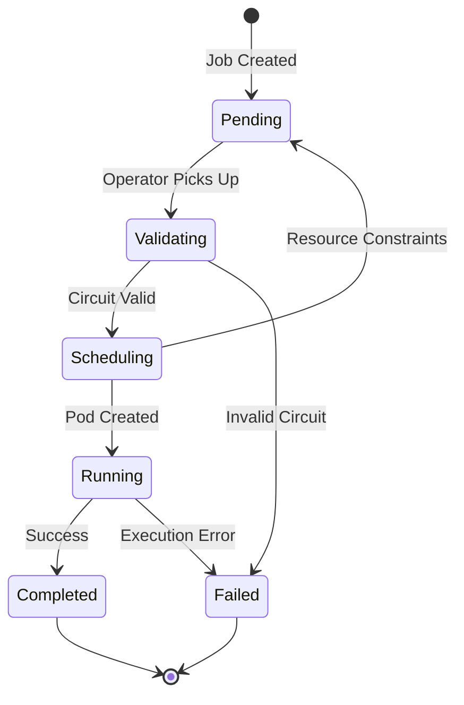

# Quantum Jobs

## Overview

`QiskitJob` is the primary Custom Resource Definition (CRD) in QiskitOperator for defining and executing quantum circuits on Kubernetes. This guide covers everything you need to know about creating, configuring, and managing quantum jobs.

## Quick Example

```yaml
apiVersion: quantum.io/v1
kind: QiskitJob
metadata:
  name: my-quantum-job
spec:
  backend:
    type: local_simulator
  circuit:
    source: inline
    code: |
      from qiskit import QuantumCircuit
      qc = QuantumCircuit(2, 2)
      qc.h(0)
      qc.cx(0, 1)
      qc.measure([0, 1], [0, 1])
  execution:
    shots: 1024
  output:
    type: configmap
    location: my-results
```

## Job Lifecycle



### Phase Descriptions

| Phase | Description | Typical Duration |
|-------|-------------|------------------|
| **Pending** | Job created, waiting for operator | <1s |
| **Validating** | Circuit syntax and backend compatibility check | 1-3s |
| **Scheduling** | Backend selection, budget verification, pod scheduling | 2-10s |
| **Running** | Circuit execution on quantum backend | 10s-10min |
| **Completed** | Results stored, resources cleaned up | N/A |
| **Failed** | Error occurred, check status for details | N/A |

## Specification Reference

### Backend Configuration

The `backend` field specifies where and how to execute your quantum circuit.

#### Local Simulator

Perfect for development and testing:

```yaml
spec:
  backend:
    type: local_simulator
```

**Features:**
- No cost
- Fast execution
- Perfect simulation (no noise)
- Supports up to ~30 qubits (depending on resources)

#### IBM Quantum Platform

Execute on real quantum computers:

```yaml
spec:
  backend:
    type: ibm_quantum
    name: ibm_brisbane  # Specific backend
    instance: "crn:v1:bluemix:public:quantum-computing:us-east:a/xxx..."  # Enterprise
  
  credentials:
    secretRef:
      name: ibm-quantum-credentials
```

**Backend Selection:**
- Specify `name` for a specific backend
- Omit `name` for automatic selection
- Use `instance` for IBM Cloud enterprise accounts

**Available Backends:**
- `ibm_brisbane` (127 qubits)
- `ibm_kyoto` (127 qubits)
- `ibm_osaka` (127 qubits)
- Check IBM Quantum dashboard for current availability

#### AWS Braket

```yaml
spec:
  backend:
    type: aws_braket
    name: "arn:aws:braket:::device/quantum-simulator/amazon/sv1"
  
  credentials:
    secretRef:
      name: aws-credentials
```

### Circuit Sources

QiskitOperator supports multiple methods for providing circuit code:

#### 1. Inline Code

Embed Qiskit code directly in the YAML:

```yaml
spec:
  circuit:
    source: inline
    code: |
      from qiskit import QuantumCircuit
      from qiskit.circuit.library import GroverOperator
      
      # Your quantum circuit here
      qc = QuantumCircuit(3, 3)
      qc.h([0, 1, 2])
      qc.measure_all()
```

**Best for:**
- Small circuits
- Quick experiments
- Tutorials and examples

#### 2. ConfigMap Reference

Store circuit code in a ConfigMap:

```bash
# Create ConfigMap
kubectl create configmap grover-circuit \
  --from-file=circuit.py=grover_algorithm.py
```

```yaml
spec:
  circuit:
    source: configmap
    configMapRef:
      name: grover-circuit
      key: circuit.py
```

**Best for:**
- Reusable circuits
- Shared team circuits
- Separation of code and configuration

#### 3. Git Repository

Fetch circuit from a Git repository:

```yaml
spec:
  circuit:
    source: git
    gitRef:
      repository: https://github.com/your-org/quantum-algorithms
      branch: main  # Optional, defaults to default branch
      path: algorithms/grover/search.py
```

**Best for:**
- Version-controlled circuits
- CI/CD integration
- Team collaboration
- Large circuit libraries

#### 4. URL

Download circuit from a URL:

```yaml
spec:
  circuit:
    source: url
    url: https://example.com/circuits/my-algorithm.py
```

**Best for:**
- External circuit libraries
- Shared public circuits
- Dynamic circuit generation

### Execution Parameters

Control how your circuit is executed:

```yaml
spec:
  execution:
    shots: 8192                    # Number of measurements (1-100000)
    optimizationLevel: 3           # Circuit optimization (0-3)
    priority: high                 # Job priority (low, normal, high, urgent)
    seedSimulator: 42              # Random seed for simulators
    initialLayout: [0, 1, 2, 3]   # Initial qubit mapping
    memoryLimit: "8Gi"             # Memory limit for simulation
```

#### Shots

Number of times to execute the circuit:

- **1-1000**: Quick tests, high statistical noise
- **1024-4096**: Standard experiments
- **8192+**: High-precision experiments, publications
- **Maximum**: 100,000 per job

#### Optimization Level

Circuit optimization before execution:

| Level | Description | Use Case |
|-------|-------------|----------|
| **0** | No optimization | Testing, debugging |
| **1** | Light optimization | Development |
| **2** | Medium optimization | Production |
| **3** | Heavy optimization | Real quantum hardware |

#### Priority

Job scheduling priority:

- **low**: Background jobs, research
- **normal** (default): Standard jobs
- **high**: Important production jobs
- **urgent**: Critical jobs (requires special RBAC)

### Session Management

Group related jobs into sessions for IBM Quantum Runtime:

```yaml
spec:
  session:
    name: vqe-optimization
    maxTime: 3600        # Maximum session duration (seconds)
    mode: dedicated      # dedicated | batch
```

**Session Benefits:**
- Reduced queue time for subsequent jobs
- Dedicated QPU access (mode: dedicated)
- Lower cost per job

**Create a Session Resource:**

```yaml
apiVersion: quantum.io/v1
kind: QiskitSession
metadata:
  name: vqe-optimization
spec:
  backend:
    type: ibm_quantum
    name: ibm_brisbane
  maxTime: 3600
  mode: dedicated
  credentials:
    secretRef:
      name: ibm-quantum-credentials
```

### Budget Management

Control costs with budget constraints:

```yaml
spec:
  budget:
    maxCost: "$10.00"           # Maximum cost for this job
    costCenter: "quantum-research"  # Cost attribution
    alertThreshold: 0.80        # Alert at 80% of max cost
```

**Budget Enforcement:**

1. **Pre-execution check**: Job won't start if it would exceed budget
2. **Real-time monitoring**: Track costs during execution
3. **Automatic termination**: Stop job if cost exceeds limit

**Create a Budget Resource:**

```yaml
apiVersion: quantum.io/v1
kind: QiskitBudget
metadata:
  name: team-quantum-budget
  namespace: my-team
spec:
  limit: "$1000.00"
  period: monthly
  alertThresholds:
    - 50
    - 80
    - 95
  notificationEmail: team-quantum@example.com
```

### Output Configuration

Specify where to store results:

#### ConfigMap (Default)

```yaml
spec:
  output:
    type: configmap
    location: my-results  # ConfigMap name
    format: json          # json | pickle | qpy | csv
```

**Best for:**
- Small results (<1MB)
- Quick experiments
- Easy kubectl access

#### Persistent Volume Claim (PVC)

```yaml
spec:
  output:
    type: pvc
    location: quantum-results  # PVC name
    path: /results/job-123.json  # Optional: specific path
    format: json
```

**Best for:**
- Large results
- Long-term storage
- Multiple jobs

**Create PVC:**

```yaml
apiVersion: v1
kind: PersistentVolumeClaim
metadata:
  name: quantum-results
spec:
  accessModes:
    - ReadWriteOnce
  resources:
    requests:
      storage: 10Gi
```

#### S3-Compatible Storage

```yaml
spec:
  output:
    type: s3
    location: s3://my-bucket/results/
    format: json
    
  credentials:
    secretRef:
      name: s3-credentials
```

**S3 Credentials Secret:**

```bash
kubectl create secret generic s3-credentials \
  --from-literal=access-key-id=YOUR_ACCESS_KEY \
  --from-literal=secret-access-key=YOUR_SECRET_KEY \
  --from-literal=endpoint=https://s3.amazonaws.com
```

#### Google Cloud Storage (GCS)

```yaml
spec:
  output:
    type: gcs
    location: gs://my-bucket/results/
    format: json
    
  credentials:
    secretRef:
      name: gcs-credentials
```

### Resource Requirements

Specify CPU and memory for executor pods:

```yaml
spec:
  resources:
    requests:
      cpu: "1"
      memory: "4Gi"
      ephemeral-storage: "10Gi"
    limits:
      cpu: "8"
      memory: "32Gi"
      ephemeral-storage: "50Gi"
```

**Guidelines:**

| Circuit Size | CPU | Memory |
|--------------|-----|--------|
| <10 qubits | 1 core | 2-4 Gi |
| 10-20 qubits | 2-4 cores | 8-16 Gi |
| 20-30 qubits | 8+ cores | 32-64 Gi |
| 30+ qubits | 16+ cores | 128+ Gi |

### Backend Selection

Automatic backend selection based on preferences:

```yaml
spec:
  backendSelection:
    weights:
      cost: 0.50          # Prefer cheaper backends
      queueTime: 0.30     # Minimize wait time
      capability: 0.15    # Prefer more capable backends
      availability: 0.05  # Prefer available backends
    
    fallbackToSimulator: true  # Use simulator if no backend available
    
    requirements:
      minQubits: 5       # Minimum number of qubits
      maxError: 0.01     # Maximum gate error rate
      maxQueueTime: 3600 # Maximum acceptable queue time (seconds)
```

**Weight Presets:**

```yaml
# Cost-optimized
backendSelection:
  weights: {cost: 0.70, queueTime: 0.20, capability: 0.05, availability: 0.05}

# Performance-optimized
backendSelection:
  weights: {cost: 0.05, queueTime: 0.05, capability: 0.70, availability: 0.20}

# Balanced
backendSelection:
  weights: {cost: 0.25, queueTime: 0.25, capability: 0.25, availability: 0.25}
```

## Advanced Features

### Retry Policy

Automatically retry failed jobs:

```yaml
spec:
  retryPolicy:
    maxRetries: 3
    backoff:
      initial: 30s
      maximum: 300s
      multiplier: 2
```

### Timeouts

Set execution timeouts:

```yaml
spec:
  timeouts:
    validation: 60s     # Validation service timeout
    execution: 3600s    # Circuit execution timeout
    total: 7200s        # Total job timeout
```

### Metadata and Labels

Organize and track jobs:

```yaml
metadata:
  name: grover-search-production
  namespace: quantum-team
  labels:
    app: qiskit-operator
    team: quantum-research
    algorithm: grover
    environment: production
    cost-center: research-dept
  annotations:
    description: "Grover search for production database"
    jira-ticket: "QUANT-123"
    owner: "alice@example.com"
```

### Pod Security

Apply security context:

```yaml
spec:
  securityContext:
    runAsNonRoot: true
    runAsUser: 1000
    fsGroup: 2000
    seccompProfile:
      type: RuntimeDefault
    capabilities:
      drop:
        - ALL
```

## Monitoring Jobs

### List Jobs

```bash
# List all jobs
kubectl get qiskitjobs

# List with more details
kubectl get qiskitjobs -o wide

# Filter by labels
kubectl get qiskitjobs -l algorithm=grover

# Watch for changes
kubectl get qiskitjobs -w
```

### Get Job Status

```bash
# Detailed status
kubectl describe qiskitjob my-quantum-job

# Get phase
kubectl get qiskitjob my-quantum-job -o jsonpath='{.status.phase}'

# Get cost
kubectl get qiskitjob my-quantum-job -o jsonpath='{.status.cost}'
```

### View Logs

```bash
# Find the executor pod
kubectl get pods -l job-name=my-quantum-job

# View logs
kubectl logs qiskit-job-my-quantum-job

# Follow logs
kubectl logs -f qiskit-job-my-quantum-job

# Previous pod logs (if pod restarted)
kubectl logs qiskit-job-my-quantum-job --previous
```

### Retrieve Results

```bash
# ConfigMap results
kubectl get configmap my-results -o yaml

# Extract JSON results
kubectl get configmap my-results -o jsonpath='{.data.results}' | jq

# PVC results
kubectl exec -it debug-pod -- cat /mnt/results/job-123.json

# S3 results
aws s3 cp s3://my-bucket/results/job-123.json -
```

## Debugging

### Common Issues

#### Job Stuck in Pending

**Symptoms:** Job stays in Pending phase

**Check:**
```bash
kubectl describe qiskitjob my-job
kubectl logs -n qiskit-operator-system deployment/qiskit-operator-controller
```

**Common causes:**
- Operator not running
- CRDs not installed
- RBAC permissions missing

#### Validation Failed

**Symptoms:** Job moves to Failed with validation error

**Check:**
```bash
kubectl get qiskitjob my-job -o jsonpath='{.status.conditions[?(@.type=="Validated")].message}'
```

**Common causes:**
- Invalid Qiskit syntax
- Missing imports
- Backend incompatibility

**Solution:** Test circuit locally first:
```python
from qiskit import QuantumCircuit
# Test your circuit code
```

#### Pod ImagePullBackOff

**Symptoms:** Executor pod can't start

**Check:**
```bash
kubectl describe pod qiskit-job-my-job
```

**Solution:**
```bash
# For Kind clusters, load image
kind load docker-image qiskit-executor:v1 --name your-cluster

# For private registries, create imagePullSecret
kubectl create secret docker-registry regcred \
  --docker-server=your-registry.com \
  --docker-username=user \
  --docker-password=pass
```

#### Budget Exceeded

**Symptoms:** Job stuck in Scheduling with budget message

**Check:**
```bash
kubectl get qiskitjob my-job -o jsonpath='{.status.conditions[?(@.type=="BudgetChecked")].message}'
```

**Solution:** Increase budget or use cheaper backend

### Debug Mode

Enable verbose logging:

```yaml
spec:
  debug: true  # Enables detailed logging
```

## Best Practices

### 1. Use Appropriate Backends

- **Development:** local_simulator
- **Testing:** ibm_simulator (cloud simulator)
- **Production:** Real quantum hardware with budget limits

### 2. Optimize Circuits

```yaml
spec:
  execution:
    optimizationLevel: 3  # Use maximum optimization for real hardware
```

### 3. Set Resource Limits

Always specify resource limits to prevent cluster resource exhaustion:

```yaml
spec:
  resources:
    limits:
      cpu: "4"
      memory: "16Gi"
```

### 4. Use Labels for Organization

```yaml
metadata:
  labels:
    team: quantum-research
    project: drug-discovery
    algorithm: vqe
    environment: production
```

### 5. Implement Cost Controls

```yaml
spec:
  budget:
    maxCost: "$10.00"
  backendSelection:
    fallbackToSimulator: true
```

### 6. Store Results Appropriately

- **Small results (<1MB):** ConfigMap
- **Medium results (1-100MB):** PVC
- **Large results (>100MB):** S3/GCS
- **Long-term storage:** S3/GCS with lifecycle policies

### 7. Use Sessions for Iterative Algorithms

```yaml
spec:
  session:
    name: vqe-session
  # VQE jobs share same session for better performance
```

## Examples

### Production VQE Job

```yaml
apiVersion: quantum.io/v1
kind: QiskitJob
metadata:
  name: vqe-h2-molecule-prod
  namespace: quantum-chemistry
  labels:
    app: qiskit-operator
    algorithm: vqe
    molecule: h2
    environment: production
spec:
  backend:
    type: ibm_quantum
    name: ibm_brisbane
  
  circuit:
    source: git
    gitRef:
      repository: https://github.com/our-org/quantum-chemistry
      branch: production
      path: vqe/h2_molecule.py
  
  execution:
    shots: 8192
    optimizationLevel: 3
    priority: high
  
  session:
    name: vqe-h2-session
    maxTime: 3600
    mode: dedicated
  
  budget:
    maxCost: "$50.00"
    costCenter: "chemistry-dept"
  
  output:
    type: s3
    location: s3://quantum-results/vqe/h2/
    format: json
  
  resources:
    requests:
      cpu: "2"
      memory: "8Gi"
    limits:
      cpu: "8"
      memory: "32Gi"
  
  credentials:
    secretRef:
      name: ibm-quantum-credentials
  
  retryPolicy:
    maxRetries: 3
    backoff:
      initial: 60s
      maximum: 600s
```

## Next Steps

- [Backend Configuration Guide](backends.md)
- [Session Management](sessions.md)
- [Budget Management](budget.md)
- [API Reference](../reference/qiskitjob.md)

